# UML Diagrams - Interview Revision Notes

## 1. Quick Summary
* **UML (Unified Modeling Language):** A standardized, diagram-based visual language used to **model the structure and behavior** of a software system before/while coding it.
* **Why it matters in LLD interviews:** Interviewers judge your design skill by how you translate requirements into **classes, relationships, and interactions**. UML (mainly **Class Diagrams** and **Sequence Diagrams**) is the notation you use to communicate that design on a whiteboard/doc.
* **Two big buckets:**
  * **Structural diagrams** — the static skeleton (what exists). E.g., Class, Object, Component, Deployment.
  * **Behavioral diagrams** — the dynamic flow (what happens over time). E.g., Sequence, Activity, State, Use Case.
* **In 90% of LLD interviews you only need:** Class Diagram (design) + Sequence Diagram (flow). The rest are good to know conceptually.

---

## 2. Types of UML Diagrams (Overview)

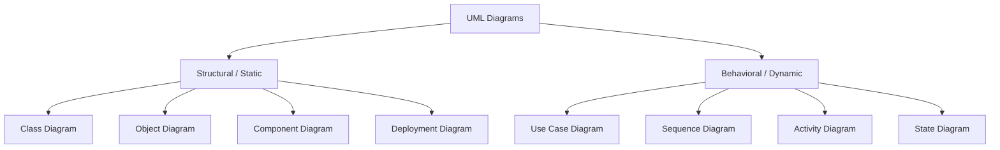

| Diagram | Type | Purpose | LLD Interview Relevance |
| :--- | :--- | :--- | :--- |
| **Class Diagram** | Structural | Classes, attributes, methods, relationships | ⭐⭐⭐⭐⭐ Must-know, drawn in nearly every round |
| **Sequence Diagram** | Behavioral | Object interactions over time for a use case/flow | ⭐⭐⭐⭐⭐ Must-know, shown after class diagram |
| **Use Case Diagram** | Behavioral | Actors + system functionality at a high level | ⭐⭐⭐ Used to gather/clarify requirements upfront |
| **Object Diagram** | Structural | Snapshot of actual object instances at runtime | ⭐⭐ Rarely drawn explicitly, good to explain |
| **Activity Diagram** | Behavioral | Flowchart-like control flow (loops, branches) | ⭐⭐ Occasionally used for algorithm-heavy flows |
| **State Diagram** | Behavioral | Object lifecycle across states (e.g., Order: Placed → Shipped → Delivered) | ⭐⭐⭐ Common for state-machine-heavy systems (e.g., vending machine, traffic light) |
| **Component Diagram** | Structural | High-level modules/services and their interfaces | ⭐ More HLD than LLD |
| **Deployment Diagram** | Structural | Physical nodes (servers, containers) running components | ⭐ More HLD than LLD |

---

## 3. Class Diagram

### 3.1 Anatomy of a Class Box
A class is drawn as a rectangle split into **3 compartments**:

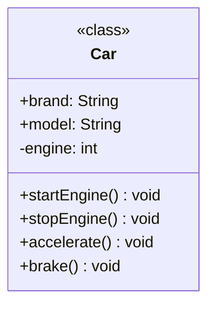

1. **Top:** Class name (Interfaces/Abstract classes use `<<interface>>` / `<<abstract>>` stereotypes).
2. **Middle:** Attributes/fields — `visibility name : type`.
3. **Bottom:** Methods/behaviors — `visibility name(params) : returnType`.

### 3.2 Visibility Modifiers

| Symbol | Meaning | Python Equivalent |
| :---: | :--- | :--- |
| `+` | Public | `self.name` (no prefix) |
| `-` | Private | `self.__name` (name-mangled, double underscore) |
| `#` | Protected | `self._name` (single underscore, convention only) |
| `~` | Package/Internal | No direct Python equivalent (module-level convention) |

> **Interview point:** Python has **no true access modifiers** — everything is enforceable only by *convention* (`_protected`, `__private`) or via `@property`. Always mention this when asked "how do you implement private members in Python?"

### 3.3 Static & Abstract Notation
* **Static member:** <u>underlined</u> in UML → In Python: `@staticmethod` / `@classmethod`, or a class-level attribute.
* **Abstract method/class:** *italicized* in UML → In Python: `abc.ABC` + `@abstractmethod`.

```python
from abc import ABC, abstractmethod

class Shape(ABC):          # abstract class
    total_shapes: int = 0  # static/class attribute (underlined in UML)

    @abstractmethod
    def area(self) -> float:   # abstract method (italicized in UML)
        ...

    @staticmethod
    def unit() -> str:
        return "sq. units"
```

### 3.4 Generic / Template Class
UML supports generics using a dashed box in the corner: `ClassName<T>`.

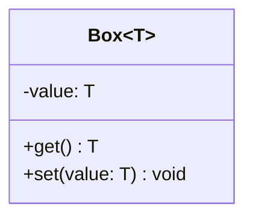

Python equivalent uses `typing.Generic` and `TypeVar`:

```python
from typing import Generic, TypeVar

T = TypeVar("T")

class Box(Generic[T]):
    def __init__(self, value: T) -> None:
        self._value = value

    def get(self) -> T:
        return self._value

    def set(self, value: T) -> None:
        self._value = value
```

---

## 4. Relationships (The Most-Asked Interview Topic)

### 4.1 The Relationship Family Tree

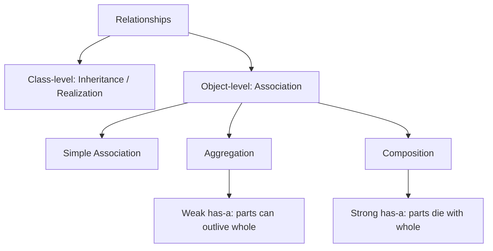

### 4.2 Notation & Strength Cheat Sheet

| Relationship | UML Arrow | Relationship Phrase | Strength (weakest → strongest) | Lifecycle Coupling |
| :--- | :--- | :--- | :---: | :--- |
| **Dependency** | `- - ->` (dashed, open arrow) | "uses-a" (temporary) | 1 | None — just a method parameter/local var |
| **Association** | `——>` (solid line, open arrow) | "uses-a" (structural) | 2 | None — objects can exist independently |
| **Aggregation** | `◇——` (hollow diamond at owner) | "has-a" (weak) | 3 | Part **can** outlive the whole |
| **Composition** | `◆——` (filled diamond at owner) | "has-a" (strong) | 4 | Part **cannot** outlive the whole |
| **Inheritance / Generalization** | `——▷` (solid line, hollow triangle) | "is-a" | 5 | Compile-time / class-level binding |
| **Realization / Implementation** | `- - -▷` (dashed line, hollow triangle) | "implements" | 5 | Interface contract binding |

### 4.3 Association (Simple)
Two independent classes know about each other and interact, but neither owns the other.

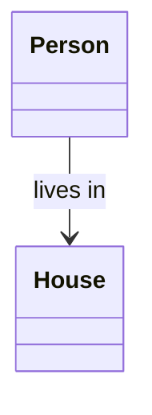

```python
class House:
    def __init__(self, address: str) -> None:
        self.address = address

class Person:
    def __init__(self, name: str, house: House) -> None:
        self.name = name
        self.house = house  # association: Person "uses" House, doesn't own its lifecycle
```
* **Multiplicity** is written at each end: `1`, `0..1`, `*` (many), `1..*` (one or more). E.g., `Person "1" --> "1" House`.
* **Navigability:** An arrowhead means the relationship is **unidirectional** (only Person knows about House). No arrowhead (plain line) means **bidirectional**.

### 4.4 Aggregation (Weak "has-a")
"Whole-part" relationship where the **part can exist independently** of the whole. Denoted by a **hollow diamond** on the owner/container side.

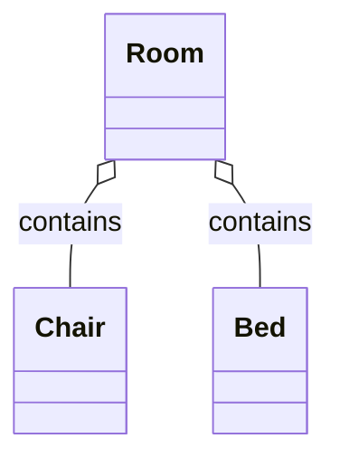

```python
class Chair:
    def __init__(self, name: str) -> None:
        self.name = name

class Room:
    def __init__(self, chairs: list["Chair"]) -> None:
        self.chairs = chairs  # aggregation: chairs are passed in, created outside Room

chair1 = Chair("Office Chair")
room = Room([chair1])
del room          # chair1 STILL exists independently — this is the key aggregation signal
print(chair1.name)
```

### 4.5 Composition (Strong "has-a")
The **part's lifecycle is bound to the whole** — if the container is destroyed, the parts die with it. Denoted by a **filled diamond**.

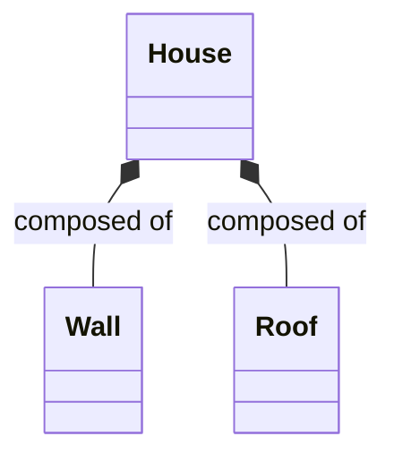

```python
class Wall:
    def __init__(self) -> None:
        print("Wall built")

class House:
    def __init__(self) -> None:
        self.walls = [Wall() for _ in range(4)]  # composition: House CREATES its own Walls internally

house = House()
del house   # walls are garbage-collected along with house — no external reference exists
```
* **Key code signal:** In composition, the *container class instantiates the part inside its own `__init__`* (`self.wall = Wall()`). In aggregation, the part is *passed in from outside* (constructor injection / setter).

### 4.6 Inheritance / Generalization ("is-a")
Denoted by a **solid line with a hollow triangle** pointing to the parent (base) class.

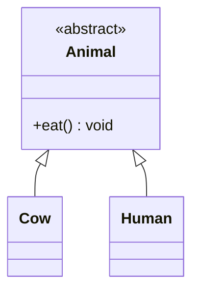

```python
class Animal:
    def eat(self) -> None:
        print("Eating...")

class Cow(Animal):      # Cow "is-a" Animal
    def eat(self) -> None:
        print("Cow grazes grass")
```

### 4.7 Realization / Implementation ("implements")
Denoted by a **dashed line with a hollow triangle**. A class provides the concrete implementation of an interface/abstract class's contract.

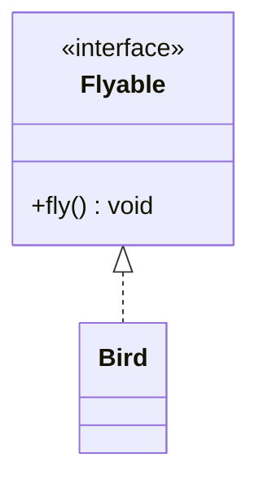

```python
from abc import ABC, abstractmethod

class Flyable(ABC):
    @abstractmethod
    def fly(self) -> None: ...

class Bird(Flyable):     # Bird "realizes"/implements Flyable
    def fly(self) -> None:
        print("Bird flies")
```
* **Interview note:** Python doesn't have a separate `interface` keyword. We simulate interfaces using `ABC` + `@abstractmethod`, or informally via **duck typing / Protocol** (`typing.Protocol`) for structural typing without inheritance.

### 4.8 Dependency ("uses-a", temporary)
Weakest relationship — one class merely **uses another momentarily**, typically as a method parameter or local variable, without holding a reference as a field.

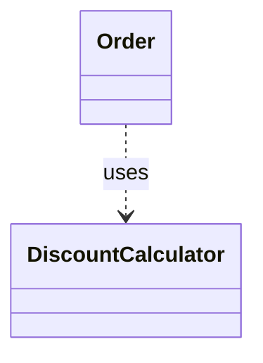

```python
class DiscountCalculator:
    def calculate(self, amount: float) -> float:
        return amount * 0.9

class Order:
    def checkout(self, amount: float, calculator: DiscountCalculator) -> float:
        # calculator is used only within this method's scope — a dependency, not a field
        return calculator.calculate(amount)
```

---

## 5. Object Diagram
* A **snapshot** of actual **instances** (objects) and their **links** at a specific point in runtime — like a specific "photo" of the class diagram's "blueprint."
* Uses the same notation as class diagrams but object names are underlined: `john : Person`.
* **Class Diagram vs Object Diagram:**

| Aspect | Class Diagram | Object Diagram |
| :--- | :--- | :--- |
| Represents | Blueprint/template (compile-time) | Actual instances (runtime snapshot) |
| Shows | Classes, attributes types, methods | Object names, actual attribute values |
| Relationships shown as | Class-to-class relationships (with multiplicity) | Object-to-object links (actual instance count) |
| Changes | Static, rarely changes | Changes every time program state changes |

---

## 6. Sequence Diagram

Shows **how objects interact with each other over time** for a specific use case/scenario — the "verb" to the class diagram's "noun."

### 6.1 Core Building Blocks

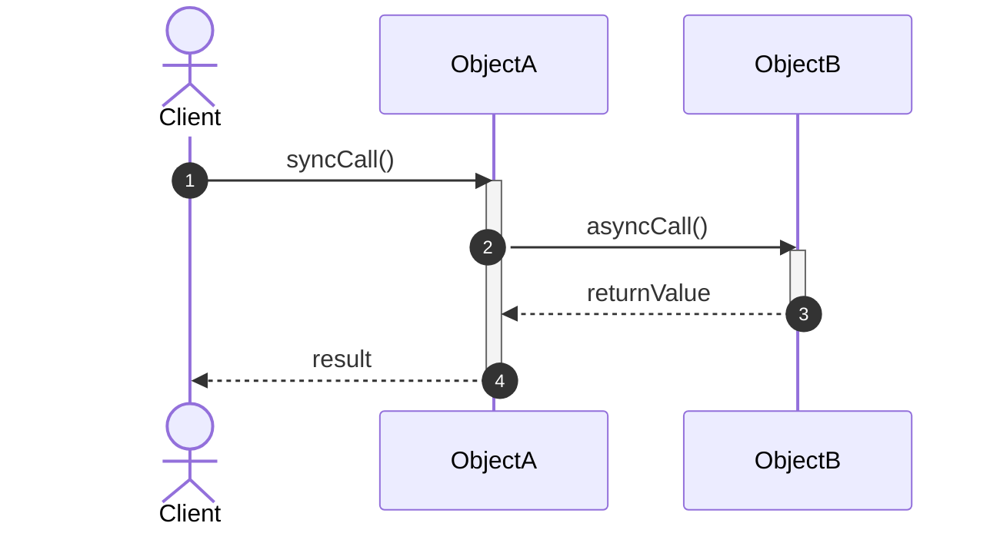

| Element | Notation | Meaning |
| :--- | :--- | :--- |
| **Actor** | Stick figure | External user/system triggering the flow |
| **Object/Participant** | Rectangle box at top | A class instance participating in the interaction |
| **Lifeline** | Dashed vertical line | The object's existence timeline (top to bottom = time) |
| **Activation Bar** | Thin rectangle on lifeline | The period an object is actively executing/processing |
| **Sync Message** | Solid line, filled arrowhead (`->>`) | Caller **waits/blocks** for the callee to finish (normal method call) |
| **Async Message** | Solid line, open arrowhead (`-)>` ) | Caller does **not wait** (e.g., fire-and-forget, message queue) |
| **Return Message** | Dashed line, open arrowhead (`-->>`) | Response flowing back after a call completes |
| **Self Message** | Loop arrow back to same lifeline | Object calling its own method |
| **Create Message** | Arrow labeled `<<create>>` | Instantiates a new object mid-flow (object's lifeline starts here) |
| **Destroy Message** | Arrow ending in `X` | Object's lifecycle ends here (garbage collected/destroyed) |
| **Lost Message** | Arrow ending at a filled circle | Message sent but never reaches a known recipient |
| **Found Message** | Arrow starting from a filled circle | Message received from an unknown/unspecified sender |

### 6.2 Combined Fragments (Control Flow inside Sequence Diagrams)

| Fragment | Keyword | Meaning | Python Analogue |
| :--- | :--- | :--- | :--- |
| **alt** | `alt / else` | Mutually exclusive branches | `if / elif / else` |
| **opt** | `opt` | Optional block, executes if condition true | `if` (no else) |
| **loop** | `loop` | Repeated execution | `for` / `while` |
| **par** | `par` | Parallel/concurrent execution | `threading` / `asyncio.gather` |

### 6.3 Worked Example: ATM Withdrawal Flow

**Use case:** User withdraws cash → ATM verifies PIN → verifies account balance → dispenses cash.

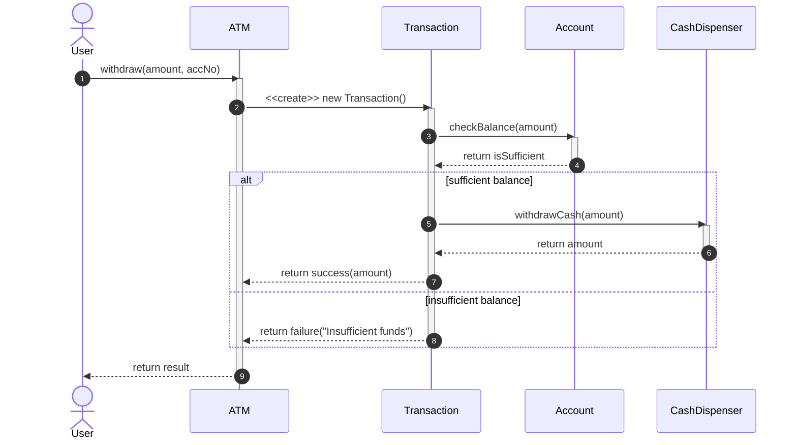

### 6.4 Corresponding Python Implementation

```python
from dataclasses import dataclass

@dataclass
class Account:
    acc_no: str
    balance: float

    def check_balance(self, amount: float) -> bool:
        return self.balance >= amount

    def debit(self, amount: float) -> None:
        self.balance -= amount


class CashDispenser:
    def __init__(self, cash_available: float) -> None:
        self.cash_available = cash_available

    def withdraw_cash(self, amount: float) -> float:
        self.cash_available -= amount
        return amount


class Transaction:
    def __init__(self, account: Account, dispenser: CashDispenser) -> None:
        self.account = account
        self.dispenser = dispenser

    def process(self, amount: float) -> str:
        if not self.account.check_balance(amount):
            return "failure: Insufficient funds"
        self.account.debit(amount)
        dispensed = self.dispenser.withdraw_cash(amount)
        return f"success: dispensed {dispensed}"


class ATM:
    def __init__(self, dispenser: CashDispenser) -> None:
        self.dispenser = dispenser

    def withdraw(self, amount: float, account: Account) -> str:
        transaction = Transaction(account, self.dispenser)  # <<create>> Transaction
        return transaction.process(amount)


if __name__ == "__main__":
    acc = Account(acc_no="ACC123", balance=5000.0)
    dispenser = CashDispenser(cash_available=100000.0)
    atm = ATM(dispenser)

    print(atm.withdraw(2000.0, acc))   # success: dispensed 2000.0
    print(atm.withdraw(10000.0, acc))  # failure: Insufficient funds
```

---

## 7. Other UML Diagrams (Conceptual Overview)

### 7.1 Use Case Diagram
* Captures **what** the system does from a user's perspective, not **how**.
* Elements: **Actor** (stick figure), **Use Case** (oval), **System boundary** (box), relationships `<<include>>` (mandatory sub-flow) and `<<extend>>` (optional sub-flow).
* Used at the **start** of an LLD interview to clarify functional requirements before drawing classes.

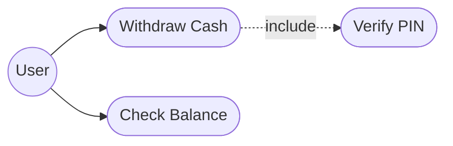

### 7.2 Activity Diagram
* Essentially a **flowchart** — models step-by-step control flow, decision points (`◇`), and parallel forks/joins (`▬`).
* Useful for describing an **algorithm or business process** (e.g., order-checkout logic) rather than object interactions.

### 7.3 State Diagram
* Models an object's **lifecycle** as a set of states and the events/transitions that move it between them.
* Very common in LLD problems that are inherently state-machine-driven: **Vending Machine, Traffic Light, Order status, Elevator, TCP connection**.

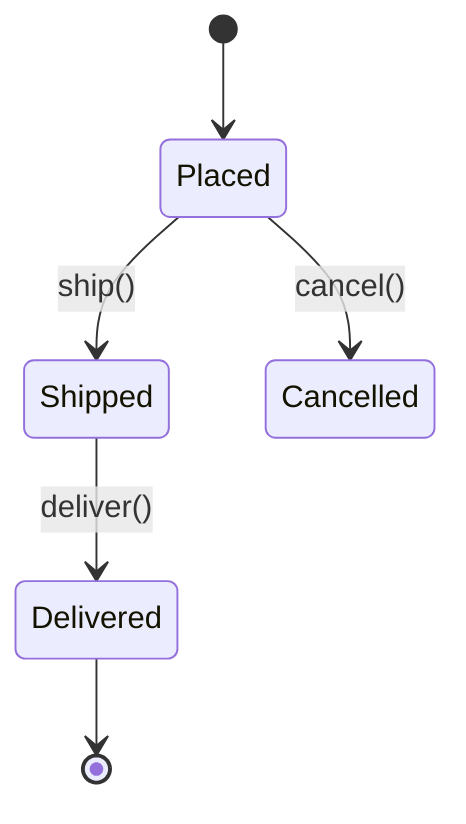

### 7.4 Component & Deployment Diagrams
* **Component Diagram:** High-level modules/services and the interfaces they expose/consume — closer to **HLD** (e.g., "Order Service" talks to "Payment Service" via a REST interface).
* **Deployment Diagram:** Physical/infrastructure view — nodes (servers, containers, devices) and what runs on them. Rarely asked in LLD rounds; more relevant for HLD/system design.

---

## 8. Diagram Comparison Cheat Sheet

| Diagram | Answers the Question | Static or Dynamic |
| :--- | :--- | :--- |
| Class Diagram | "What are the entities and how are they structurally related?" | Static |
| Object Diagram | "What do the entities look like at this exact moment?" | Static (snapshot) |
| Sequence Diagram | "In what order do these entities talk to each other for scenario X?" | Dynamic |
| Use Case Diagram | "What can the user do with this system?" | N/A (requirements view) |
| Activity Diagram | "What is the step-by-step logic/algorithm?" | Dynamic |
| State Diagram | "What states can this single object be in, and how does it move between them?" | Dynamic |

---

## 9. Interview FAQs

* **Q: Aggregation vs Composition — the #1 asked question. How do you explain it?**
  * *A:* Both are "has-a" relationships. The difference is **ownership/lifecycle**:
    * **Aggregation** = weak has-a. The part can exist without the whole (e.g., a `Room` has `Chairs`, but chairs can exist and be moved to another room even if this room is destroyed).
    * **Composition** = strong has-a. The part's lifecycle is **bound** to the whole (e.g., a `House` has `Walls` — destroy the house, the walls cease to logically exist too).
  * In code, the tell-tale sign: **who instantiates the part?** If the container creates it internally (`self.wall = Wall()`) → composition. If it's injected from outside (`def __init__(self, wall): self.wall = wall`) → aggregation.

* **Q: Does Python enforce composition/aggregation semantics at runtime?**
  * *A:* No — Python has no ownership/lifetime enforcement like C++ (no destructors tied to scope in the same way). Composition vs aggregation in Python is a **design intent captured by convention** (where/how the object is constructed), not something the language enforces. Garbage collection reclaims objects based on reference counts, regardless of "logical ownership."

* **Q: Association vs Dependency — what's the real difference?**
  * *A:* **Association** is a structural, usually longer-lived relationship — typically stored as an instance attribute/field. **Dependency** is a much weaker, transient relationship — typically just a method parameter or local variable, not stored as state.

* **Q: How do you show an interface in Python UML/code since Python doesn't have a real `interface` keyword?**
  * *A:* Use `abc.ABC` with `@abstractmethod` methods to simulate a formal interface (realization relationship), or use `typing.Protocol` for structural/duck-typed interfaces where no explicit inheritance is required.

* **Q: What does multiplicity like `1..*` mean on an association?**
  * *A:* It specifies how many instances of one class relate to one instance of another. Common values: `1` (exactly one), `0..1` (zero or one), `*` or `0..*` (zero or many), `1..*` (one or more). E.g., `Order "1" --> "1..*" OrderItem` means one Order has one-or-more OrderItems.

* **Q: In an LLD interview, what's the actual expected sequence of steps?**
  1. Clarify requirements (mentally do a **Use Case** pass — actors + core use cases).
  2. Identify key **classes/entities, attributes, and relationships** → draw the **Class Diagram**.
  3. Pick 1–2 core flows and walk through **Sequence Diagrams** to validate the design handles them well.
  4. Mention **design patterns** and **SOLID principles** applied, and discuss extensibility/edge cases.

* **Q: Why do interviewers care about UML at all if you're just going to write code?**
  * *A:* UML is a **thinking + communication tool**. It forces you to nail down responsibilities, relationships, and interaction order *before* writing code, which is exactly the skill LLD rounds are testing — not the syntax of a specific diagramming tool.
