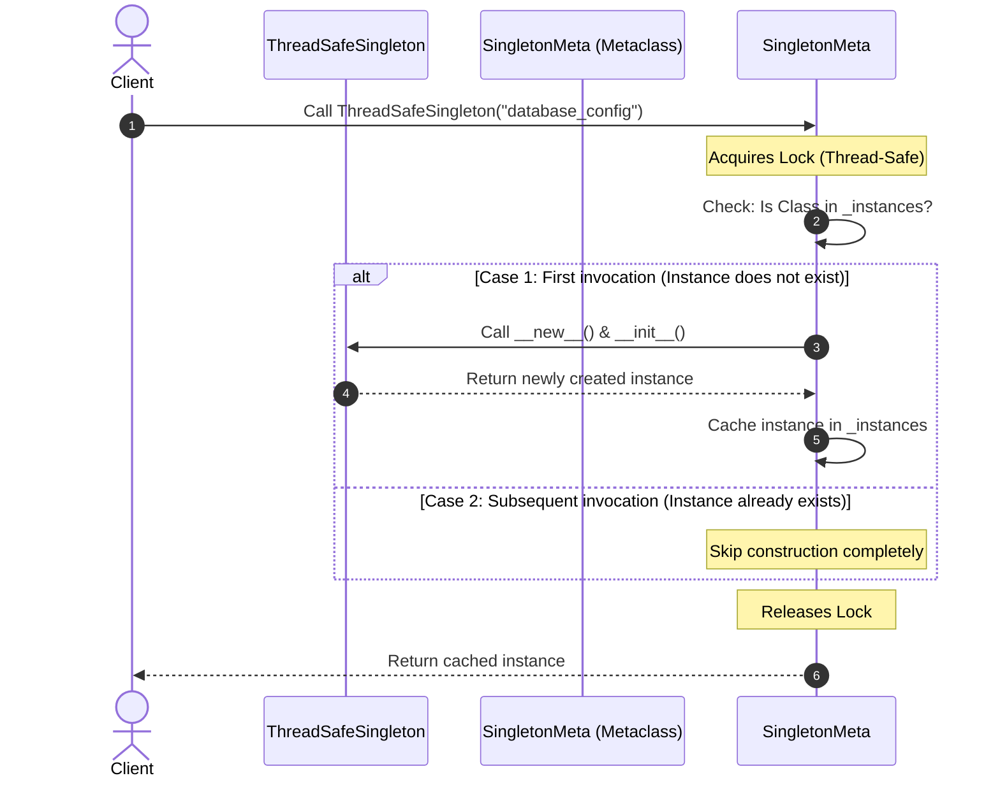

# Creational Pattern: Singleton

A concise, interview-ready guide on the **Singleton Design Pattern** in Python, covering implementation patterns, thread-safety under the GIL, edge-case vulnerabilities (like the `__init__` re-execution trap), and modern Pythonic alternatives.

---

## 🏗️ Core Classifications (Python Implementation Strategies)

In Python, there are multiple ways to implement a Singleton, each with different trade-offs regarding readability, robustness, and support for object-oriented principles:

```mermaid
graph TD
    Singleton[Singleton Strategies] --> Metaclass[1. Metaclass Approach (Cleanest/Most Robust)]
    Singleton --> Decorator[2. Decorator Approach (Highly Readable)]
    Singleton --> NewOverride[3. __new__ Override (Classic, but has __init__ trap)]
    Singleton --> ModuleLevel[4. Module-Level (Pythonic / Simple / Eager)]
```

---

## ⚡ 1. Naive Implementation & The Python `__init__` Trap (The "Bad" Code)

Overriding `__new__` is the most common naive Singleton pattern shown in basic tutorials. However, in Python, this approach has a severe flaw.

### 🐍 Naive Code:
```python
# BAD: Naive Lazy Initialization with __new__
class NaiveSingleton:
    _instance = None

    def __new__(cls, *args, **kwargs):
        if not cls._instance:
            cls._instance = super().__new__(cls)
        return cls._instance

    def __init__(self, value: int):
        # TRAP: This runs EVERY time NaiveSingleton() is called!
        self.value = value
```

### Why is this BAD? (Interview Explanation)
1. **The `__init__` Re-execution Trap:** 
   In Python, calling a class constructor `C()` executes `__new__` to allocate the object, and *then* automatically calls `__init__` on the returned object. 
   Even if `__new__` intercepts the call and returns the cached instance, Python **still runs `__init__` on it every single time**.
   ```python
   s1 = NaiveSingleton(10)
   print(s1.value)  # Output: 10
   
   s2 = NaiveSingleton(20) # Modifies s1.value silently!
   print(s1.value)  # Output: 20
   print(s1 is s2)  # Output: True (Same object instance, but state was overwritten!)
   ```
2. **Race Conditions (Not Thread-Safe):** 
   If two threads access `NaiveSingleton()` simultaneously, both can evaluate `_instance is None` as true and create duplicate instances.

---

## ⚡ 2. How to Break a Python Singleton & How to Defend It

In Python LLD interviews, you are often asked: *"How can you break a Singleton in Python, and how do you prevent it?"*

| Attack Vector | How it Breaks Singleton | The Defense / Fix |
| :--- | :--- | :--- |
| **Multithreading** | Context switching between threads during instance checking results in duplicate instances. | Use a **thread lock** (`threading.Lock()`) inside the instantiation logic. |
| **Re-initialization** | Accessing the class directly executes `__init__` again, resetting state. | Use a **Metaclass** (overriding `__call__` prevents `__init__` re-run) or keep an init flag. |
| **Cloning / Copying** | Using `copy.copy(obj)` or `copy.deepcopy(obj)` creates duplicate instances. | Override `__copy__` and `__deepcopy__` to return the existing instance (`self`). |
| **Serialization (Pickling)** | Serializing with `pickle.dumps()` and deserializing with `pickle.loads()` constructs a new instance. | Override the `__reduce__` method to return the class reference and instantiation arguments. |

---

## ⚡ 3. Production-Grade Implementation (The "Good" Code)

Using a **Metaclass** is the standard approach for Python Singletons. It intercepts class creation and instantiation, avoiding the `__init__` re-execution trap completely, and allows us to easily inject thread-safety locks.

### 📊 Interaction Sequence Diagram


### 🐍 Production Code:
```python
import threading
import copy
import pickle

class SingletonMeta(type):
    """
    A thread-safe Metaclass implementation of Singleton.
    Metaclass __call__ intercepts the creation of class instances.
    """
    _instances = {}
    _lock = threading.Lock() # Lock for thread safety

    def __call__(cls, *args, **kwargs):
        # Double-checked locking to minimize lock contention overhead
        if cls not in cls._instances:
            with cls._lock:
                if cls not in cls._instances:
                    # super().__call__ invokes __new__ and __init__ of the target class
                    cls._instances[cls] = super().__call__(*args, **kwargs)
        return cls._instances[cls]


class ThreadSafeSingleton(metaclass=SingletonMeta):
    def __init__(self, value: str):
        # This will run ONLY ONCE when the instance is first created!
        self.value = value
        self.connection = f"Connected to {value}"

    # --- Copy Defense ---
    def __copy__(self):
        return self

    def __deepcopy__(self, memo):
        return self

    # --- Serialization (Pickle) Defense ---
    def __reduce__(self):
        # Tells pickle to recreate the object by calling ThreadSafeSingleton with value
        return (ThreadSafeSingleton, (self.value,))
```

> [!IMPORTANT]
> **Why does Metaclass solve the `__init__` trap?**
> When a class uses a metaclass, instantiating the class (e.g., `ThreadSafeSingleton("value")`) triggers the metaclass's `__call__` method.
> - In `__call__`, we check if the instance is already cached in `_instances`.
> - If it is cached, we return it directly. `super().__call__` is **never** invoked again, meaning `__init__` on the class is **never** executed more than once.

---

## ⚡ 4. Modern & Clean Alternatives

### Option A: The Pythonic Decorator Approach
Decorators are highly readable and easy to apply to any class.

```python
import threading

def thread_safe_singleton(cls):
    instances = {}
    lock = threading.Lock()

    def get_instance(*args, **kwargs):
        if cls not in instances:
            with lock:
                if cls not in instances:
                    instances[cls] = cls(*args, **kwargs)
        return instances[cls]
        
    return get_instance

@thread_safe_singleton
class AppConfig:
    def __init__(self, path: str):
        self.path = path
```
* **Pros:** Simple, extremely readable, and doesn't pollute class inheritance hierarchies.
* **Cons:** The decorated entity is no longer a class type object but a function wrapper (`get_instance`), which can break static analysis tools, IDE autocompletion, or inheritance/subclassing of the Singleton.

### Option B: The Module-Level Import (Pythonic Way)
In Python, modules act as natural singletons because `import` statements cache modules in `sys.modules` once.

```python
# config_module.py
class DatabaseConfig:
    def __init__(self):
        self.host = "localhost"
        self.port = 5432

# Instantiate the single global copy right inside the module
config_instance = DatabaseConfig()
```

```python
# client.py
# Importing config_instance from any file yields the exact same instance!
from config_module import config_instance
```
* **Pros:** 100% thread-safe natively (module imports are atomic in Python), zero boilerplate code.
* **Cons:** Eager initialization (loaded when imported), lacks OOP structure if lazy-loading is required for resource optimization.

---

## 🆚 Quick Reference: Python Singleton Approaches

| Metric | Metaclass (Recommended) | Class Decorator | `__new__` Override | Module Import |
| :--- | :--- | :--- | :--- | :--- |
| **Thread Safety** |  Yes (Using `Lock`) |  Yes (Using `Lock`) |  Yes (Using `Lock`) |  Yes (By CPython loader) |
| **`__init__` Trap Safe**|  Yes |  Yes | ❌ No |  Yes |
| **OOP Support** |  Yes (Maintains class type) | ❌ No (Becomes function) |  Yes | ❌ No |
| **Lazy Loading** |  Yes |  Yes |  Yes | ❌ No (Eager on import) |

---

## 🧠 Interview FAQs (Tips for answering)

* **Q: Does Python's GIL make Singletons thread-safe automatically?**
  * *A:* **No.** The Global Interpreter Lock (GIL) only guarantees thread-safety for single bytecode operations. Class instantiation involves multiple bytecodes (checking a variable, acquiring resources, and writing properties). A context switch can occur between these bytecodes, so an explicit lock (`threading.Lock`) is mandatory.
* **Q: How does Singleton violate the SOLID principles?**
  * *A:* It violates the **Single Responsibility Principle (SRP)** because the class is responsible both for its core business logic and for managing its own instantiation lifetime.
* **Q: How do you mock a Singleton during Unit Testing in Python?**
  * *A:* You can mock the class variable caching the instance. For example, if using the metaclass pattern:
    ```python
    import unittest
    from unittest.mock import patch
    
    # Resetting the cached instance between tests to prevent test pollution
    def setUp(self):
        ThreadSafeSingleton._instances.clear()
    ```
