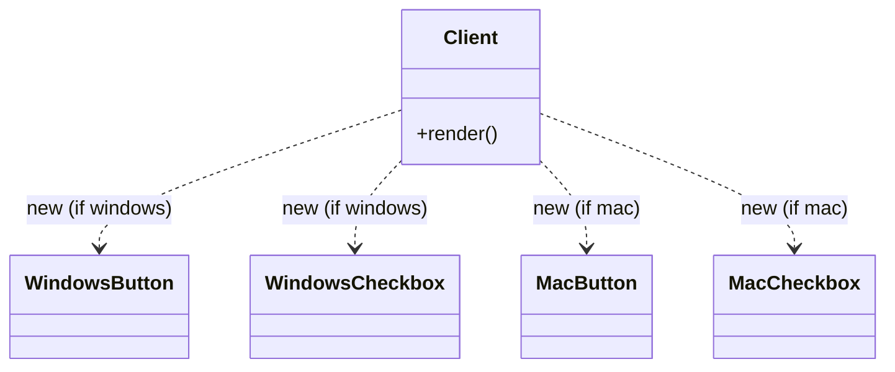
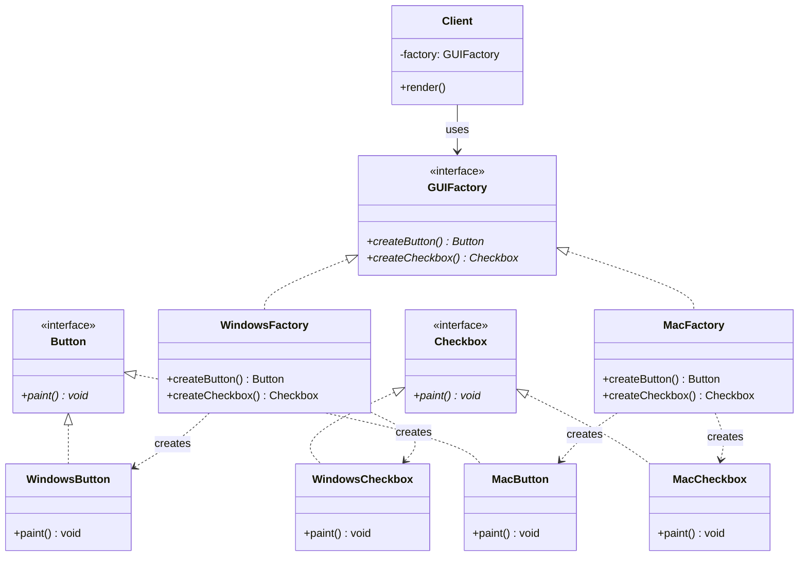

# Creational Pattern: Abstract Factory

## 1. Quick Summary
* **Intent:** Provide interface to create **families of related objects** without specifying their concrete classes. "Factory of factories."
* **Core Philosophy:** Group product creation so that products from **same family always match**. Client never picks concrete class — picks family (factory), gets whole matching set.
* **Analogy:** Cross-platform UI kit. Pick "Windows" or "Mac" theme once. Every widget after that (Button, Checkbox) auto-matches — no mixing Windows button with Mac checkbox by mistake.
* **Mechanism:** Composition (factory holds/creates products), unlike Factory Method which uses Inheritance.

---

## 2. Why Use It? (Problem vs Solution)

### Without Pattern (Naive/Tightly-Coupled)
Client code directly `new`s concrete classes per platform:

```python
os_name = "windows"

if os_name == "windows":
    button = WindowsButton()
    checkbox = WindowsCheckbox()
else:
    button = MacButton()
    checkbox = MacCheckbox()
```

Problems:
* **Scattered conditionals:** Same `if/else` on `os_name` repeated everywhere a widget is created.
* **Mismatch risk:** Nothing stops accidentally creating `WindowsButton` + `MacCheckbox` — inconsistent family, easy bug.
* **Violates OCP:** New platform (Linux) → hunt down and edit every `if/else` block across codebase.
* **Violates DIP:** Client code depends on concrete classes (`WindowsButton`), not abstractions.

### With Pattern (Abstract Factory)
* Define abstract product interfaces (`Button`, `Checkbox`).
* Define abstract factory interface (`GUIFactory`) declaring one creation method per product type.
* Each concrete factory (`WindowsFactory`, `MacFactory`) creates **one consistent family**.
* Client asks factory for products — never picks concrete class, never repeats `if/else`, family consistency **guaranteed by construction**.

```python
factory = get_factory(os_name)   # decided ONCE
button = factory.create_button()
checkbox = factory.create_checkbox()
```

---

## 3. UML Diagrams

### Without Pattern — Client Coupled to Concretes

Client directly references 4 concrete classes and branches on platform — no shared abstraction, no guardrail against mismatched pairs.

### With Pattern — Abstract Factory

**Key insight:** `Client` depends only on `GUIFactory` + `Button`/`Checkbox` abstractions. Swap entire family by swapping one factory instance — no conditionals in client, no cross-family mixing possible.

---

## 4. Python Implementation

### 4a. Without Pattern (Naive)
```python
class WindowsButton:
    def paint(self) -> None:
        print("Rendering Windows-style Button")

class WindowsCheckbox:
    def paint(self) -> None:
        print("Rendering Windows-style Checkbox")

class MacButton:
    def paint(self) -> None:
        print("Rendering Mac-style Button")

class MacCheckbox:
    def paint(self) -> None:
        print("Rendering Mac-style Checkbox")

def render_ui(os_name: str) -> None:
    # this if/else has to be repeated at EVERY place a widget is created
    if os_name == "windows":
        button = WindowsButton()
        checkbox = WindowsCheckbox()
    elif os_name == "mac":
        button = MacButton()
        checkbox = MacCheckbox()
    else:
        raise ValueError(f"Unknown OS: {os_name}")

    button.paint()
    checkbox.paint()

if __name__ == "__main__":
    render_ui("windows")
    render_ui("mac")
    # nothing stops render_ui from being edited to mismatch e.g. WindowsButton + MacCheckbox
```

### 4b. With Abstract Factory (GoF)
```python
from abc import ABC, abstractmethod

# ==========================================
# 1. ABSTRACT PRODUCTS
# ==========================================
class Button(ABC):
    @abstractmethod
    def paint(self) -> None:
        pass

class Checkbox(ABC):
    @abstractmethod
    def paint(self) -> None:
        pass

# ==========================================
# 2. CONCRETE PRODUCTS — Windows Family
# ==========================================
class WindowsButton(Button):
    def paint(self) -> None:
        print("Rendering Windows-style Button")

class WindowsCheckbox(Checkbox):
    def paint(self) -> None:
        print("Rendering Windows-style Checkbox")

# ==========================================
# 2. CONCRETE PRODUCTS — Mac Family
# ==========================================
class MacButton(Button):
    def paint(self) -> None:
        print("Rendering Mac-style Button")

class MacCheckbox(Checkbox):
    def paint(self) -> None:
        print("Rendering Mac-style Checkbox")

# ==========================================
# 3. ABSTRACT FACTORY
# ==========================================
class GUIFactory(ABC):
    @abstractmethod
    def create_button(self) -> Button:
        pass

    @abstractmethod
    def create_checkbox(self) -> Checkbox:
        pass

# ==========================================
# 4. CONCRETE FACTORIES — one per family
# ==========================================
class WindowsFactory(GUIFactory):
    def create_button(self) -> Button:
        return WindowsButton()

    def create_checkbox(self) -> Checkbox:
        return WindowsCheckbox()

class MacFactory(GUIFactory):
    def create_button(self) -> Button:
        return MacButton()

    def create_checkbox(self) -> Checkbox:
        return MacCheckbox()

# ==========================================
# 5. CLIENT — depends only on abstractions
# ==========================================
def render_ui(factory: GUIFactory) -> None:
    button = factory.create_button()
    checkbox = factory.create_checkbox()
    button.paint()
    checkbox.paint()

def get_factory(os_name: str) -> GUIFactory:
    factories = {"windows": WindowsFactory, "mac": MacFactory}
    if os_name not in factories:
        raise ValueError(f"Unknown OS: {os_name}")
    return factories[os_name]()

if __name__ == "__main__":
    render_ui(get_factory("windows"))
    # Rendering Windows-style Button
    # Rendering Windows-style Checkbox

    render_ui(get_factory("mac"))
    # Rendering Mac-style Button
    # Rendering Mac-style Checkbox
```
`render_ui` has **zero** `if/else` on OS. Adding Linux family later = add `LinuxButton`, `LinuxCheckbox`, `LinuxFactory` — `render_ui` and `get_factory` caller code untouched (only the small factory-selection map grows).

---

## 5. Real-World Examples

| System | How Abstract Factory Is Used |
| :--- | :--- |
| **GUI Toolkits** (Qt, wxWidgets) | Theme/OS-specific widget families — swap look-and-feel by swapping factory. |
| **Database drivers** | `ConnectionFactory` producing matching `Connection`, `Command`, `Transaction` objects consistent per DB vendor (Postgres vs MySQL). |
| **Cloud SDK abstractions** | A `CloudFactory` producing matching `Storage`, `Compute`, `Queue` clients per provider (AWS vs GCP) so app code stays provider-agnostic. |
| **Document rendering** | `DocumentFactory` producing matching `Paragraph`, `Table`, `Image` renderers per output format (PDF vs HTML). |
| **Game skins/themes** | `MedievalFactory` vs `SciFiFactory` each producing matching `Character`, `Weapon`, `Environment` assets — no mixing sword with laser rifle. |

---

## 6. Quick Reference: Differences

| Feature | Factory Method | Abstract Factory |
| :--- | :--- | :--- |
| **Mechanism** | Inheritance — subclass overrides one creation method | Composition — factory object holds multiple creation methods |
| **Products Created** | One product | Family of related products |
| **Extend by** | New product → new `Creator` subclass | New family → new concrete factory implementing all creation methods |
| **Consistency Guarantee** | None built-in (only one product type at a time) | Guarantees products from same call are always from same family |
| **Relation** | Abstract Factory is often **implemented using** several Factory Methods (one per product type) inside each concrete factory | Built from Factory Methods |

---

## 7. When to Use
1. **Product families must stay consistent** — e.g., never mix Windows button with Mac checkbox.
2. **System should be independent of how products are created/composed** — swap entire family via config/DI, not scattered conditionals.
3. **You're providing a library/framework** and want callers to extend with new families without touching your code (OCP).

## 8. Pitfalls
* **Rigid interface:** Adding a **new product type** (e.g., `Slider`) to the family means editing `GUIFactory` interface AND every concrete factory — expensive, breaks OCP in that direction (only adding new *families* is cheap, not new *product types*).
* **Overkill for single-family apps:** If you'll only ever have one product family, plain Factory Method or even direct instantiation is simpler — don't add this ceremony speculatively.
* **More classes/boilerplate:** Every product needs an abstract + N concrete implementations, same for factories — verbose for small families.

---

## 9. Interview FAQs

> [!TIP]
> **Q: How is Abstract Factory different from just having multiple Factory Methods?**
> * A single Factory Method creates **one** product. Abstract Factory groups **multiple** Factory Methods (one per product type) into one factory interface so that a single concrete factory produces a whole **matching set**. Internally, each `createX()` method inside a concrete factory often *is* a Factory Method.

> [!TIP]
> **Q: Why "family of related objects" — what breaks if you don't enforce this?**
> * Without a shared factory, nothing stops mixing incompatible products (e.g., a `WindowsButton` next to a `MacCheckbox`) — visually/behaviorally inconsistent, and the bug is easy to introduce accidentally since each widget is created independently.

> [!WARNING]
> **Q: What's the main extensibility weakness of Abstract Factory?**
> * Adding a **new product type** (not a new family) forces you to change the abstract factory interface and every single concrete factory implementation — an OCP violation. Abstract Factory only keeps OCP clean for adding new **families**, not new **product kinds**.

> [!TIP]
> **Q: Abstract Factory vs Builder — both build complex things, what's the difference?**
> * Abstract Factory returns products **immediately**, one call per product, focused on **family consistency**. Builder constructs **one complex object step-by-step** (often with optional parts), focused on **construction process**, and typically returns the finished object only at the end via `build()`/`getResult()`.
