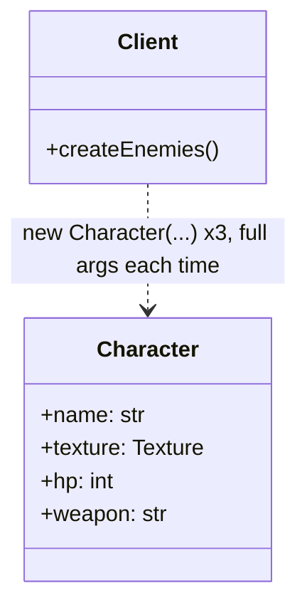
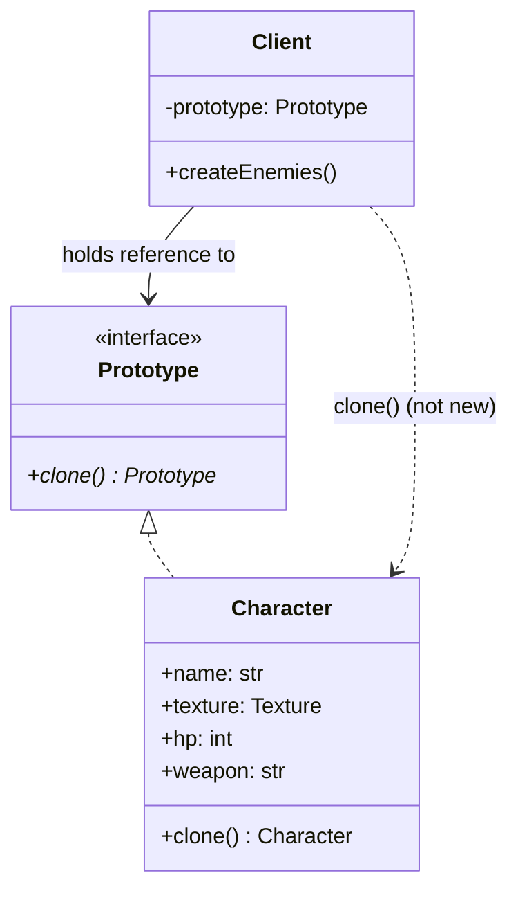

# Creational Pattern: Prototype

## 1. Quick Summary
* **Intent:** Create new objects by **copying (cloning) an existing object** (the "prototype") instead of instantiating via constructor/`new`.
* **Core Philosophy:** "Copy existing instance" instead of "build from scratch." Useful when object creation is **expensive** (DB call, network fetch, heavy computation) or when object has many configured fields and you want a pre-set baseline to vary slightly.
* **Analogy:** Cell division/photocopier. Instead of drawing a document from blank page every time, photocopy an existing one and tweak the copy. Copy already has all formatting/content — cheaper than recreating from scratch.
* **Mechanism:** Object itself implements a `clone()` method — knows how to copy itself, including private fields the client can't see.

---

## 2. Why Use It? (Problem vs Solution)

### Without Pattern (Naive Re-construction)
Say `Character` in a game has expensive setup (loads texture from disk, computes stats):

```python
enemy1 = Character(name="Orc", texture=load_texture_from_disk("orc.png"), hp=100, weapon="Axe")
enemy2 = Character(name="Orc", texture=load_texture_from_disk("orc.png"), hp=100, weapon="Sword")
enemy3 = Character(name="Orc", texture=load_texture_from_disk("orc.png"), hp=100, weapon="Bow")
```

Problems:
* **Repeated expensive work:** `load_texture_from_disk` re-runs for every enemy — same texture loaded 3x.
* **Client needs full knowledge of construction:** Client must know every constructor param to recreate similar object — tight coupling to concrete class internals.
* **Can't copy private/internal state:** If object built up internal state through many method calls after construction (not just constructor args), client has no way to replicate that from outside.
* **Verbose duplication:** Client re-specifies near-identical field values again and again.

### With Pattern (Prototype)
* Object exposes `clone()` — internally copies itself (shallow or deep as needed), including private state.
* Create one fully-configured prototype **once** (expensive setup paid once), then `clone()` it repeatedly (cheap) and tweak only what differs.

```python
orc_prototype = Character(name="Orc", texture=load_texture_from_disk("orc.png"), hp=100, weapon="Axe")

enemy1 = orc_prototype.clone()
enemy2 = orc_prototype.clone(); enemy2.weapon = "Sword"
enemy3 = orc_prototype.clone(); enemy3.weapon = "Bow"
# texture loaded from disk ONCE
```

---

## 3. UML Diagrams

### Without Pattern — Client Rebuilds From Scratch

Client repeats full constructor call (and repeats expensive `load_texture_from_disk`) for every similar object.

### With Pattern — Prototype

**Key insight:** `Client` calls `clone()` on an existing instance, never `new Character(...)` with the full field list again — object knows how to copy itself.

---

## 4. Python Implementation

Python gives you `copy.copy()` (shallow) and `copy.deepcopy()` (deep) built-in — Prototype pattern in Python usually means wrapping these behind a `clone()` method, or overriding `__copy__`/`__deepcopy__` for custom behavior.

### 4a. Without Pattern (Naive)
```python
import time

class Texture:
    def __init__(self, path: str) -> None:
        print(f"Loading texture from disk: {path} (expensive I/O)...")
        time.sleep(0.5)   # simulate expensive load
        self.path = path

class Character:
    def __init__(self, name: str, texture: Texture, hp: int, weapon: str) -> None:
        self.name = name
        self.texture = texture
        self.hp = hp
        self.weapon = weapon

    def __repr__(self) -> str:
        return f"Character(name={self.name}, weapon={self.weapon}, hp={self.hp})"

if __name__ == "__main__":
    # texture loaded 3 separate times — expensive and wasteful
    enemy1 = Character("Orc", Texture("orc.png"), 100, "Axe")
    enemy2 = Character("Orc", Texture("orc.png"), 100, "Sword")
    enemy3 = Character("Orc", Texture("orc.png"), 100, "Bow")
```

### 4b. With Prototype Pattern
```python
import copy
import time
from abc import ABC, abstractmethod

class Texture:
    def __init__(self, path: str) -> None:
        print(f"Loading texture from disk: {path} (expensive I/O)...")
        time.sleep(0.5)   # simulate expensive load
        self.path = path

# ==========================================
# 1. PROTOTYPE INTERFACE
# ==========================================
class Prototype(ABC):
    @abstractmethod
    def clone(self) -> "Prototype":
        pass

# ==========================================
# 2. CONCRETE PROTOTYPE
# ==========================================
class Character(Prototype):
    def __init__(self, name: str, texture: Texture, hp: int, weapon: str) -> None:
        self.name = name
        self.texture = texture   # shared, expensive-to-build resource
        self.hp = hp
        self.weapon = weapon

    def clone(self) -> "Character":
        # shallow copy: new Character instance, but `texture` object is SHARED
        # (deliberate — texture is immutable/read-only, no need to duplicate it)
        return copy.copy(self)

    def __repr__(self) -> str:
        return f"Character(name={self.name}, weapon={self.weapon}, hp={self.hp}, texture_id={id(self.texture)})"

# ==========================================
# 3. CLIENT
# ==========================================
if __name__ == "__main__":
    orc_prototype = Character("Orc", Texture("orc.png"), 100, "Axe")   # expensive load ONCE

    enemy1 = orc_prototype.clone()
    enemy2 = orc_prototype.clone()
    enemy2.weapon = "Sword"          # tweak the copy, prototype untouched
    enemy3 = orc_prototype.clone()
    enemy3.weapon = "Bow"

    print(orc_prototype)   # Character(name=Orc, weapon=Axe, ...)
    print(enemy1)          # Character(name=Orc, weapon=Axe, ...)
    print(enemy2)          # Character(name=Orc, weapon=Sword, ...)
    print(enemy3)          # Character(name=Orc, weapon=Bow, ...)
    print(enemy1.texture is orc_prototype.texture)   # True — texture object shared, not reloaded
```

### 4c. Shallow vs Deep Clone — the Classic Interview Trap

**Definitions:**
* **Shallow copy:** New top-level object created, but its fields are copied **by reference**. If a field points to another (mutable) object, both original and copy point to the **same** nested object — mutate nested object via one, other sees change too. Only one level of copying happens.
* **Deep copy:** New top-level object created, and **every nested object is recursively copied too** (new object graph, not shared references). Original and copy become **fully independent** — mutating one never affects other, no matter how deeply nested.

Rule of thumb: shallow copy duplicates the "box," deep copy duplicates "box + everything inside it, all the way down."

```python
import copy

class Inventory:
    def __init__(self) -> None:
        self.items: list[str] = []

class Player:
    def __init__(self, name: str) -> None:
        self.name = name
        self.inventory = Inventory()   # mutable nested object

    def shallow_clone(self) -> "Player":
        return copy.copy(self)         # inventory reference SHARED between original & clone

    def deep_clone(self) -> "Player":
        return copy.deepcopy(self)     # inventory fully duplicated, independent

if __name__ == "__main__":
    p1 = Player("Hero")
    p1.inventory.items.append("Sword")

    # BUG: shallow clone shares the same Inventory object
    p2 = p1.shallow_clone()
    p2.inventory.items.append("Shield")
    print(p1.inventory.items)   # ['Sword', 'Shield']  <-- p1 polluted by p2's change!

    # Correct: deep clone gives fully independent nested state
    p3 = p1.deep_clone()
    p3.inventory.items.append("Bow")
    print(p1.inventory.items)   # ['Sword', 'Shield']  <-- untouched
    print(p3.inventory.items)   # ['Sword', 'Shield', 'Bow']
```
* **Shallow copy:** Copies top-level object, but nested **mutable objects are shared by reference**. Fast, cheap — safe only if nested objects are immutable or intentionally meant to be shared (like the `Texture` example above).
* **Deep copy:** Recursively copies every nested object too. Fully independent, but slower and more memory — needed whenever nested mutable state must not leak between original and clone.

---

## 5. Prototype Registry (Common Real-World Variant)
Instead of client holding one prototype, keep a **registry/cache** of pre-configured prototypes keyed by type, clone on demand:

```python
class CharacterRegistry:
    def __init__(self) -> None:
        self._prototypes: dict[str, Character] = {}

    def register(self, key: str, prototype: Character) -> None:
        self._prototypes[key] = prototype

    def create(self, key: str) -> Character:
        prototype = self._prototypes.get(key)
        if prototype is None:
            raise ValueError(f"No prototype registered for: {key}")
        return prototype.clone()

if __name__ == "__main__":
    registry = CharacterRegistry()
    registry.register("orc", Character("Orc", Texture("orc.png"), 100, "Axe"))
    registry.register("goblin", Character("Goblin", Texture("goblin.png"), 50, "Dagger"))

    wave = [registry.create("orc") for _ in range(3)] + [registry.create("goblin") for _ in range(2)]
    # each create() = cheap clone, textures loaded once per type at registration time
```
This is how Prototype is usually seen in production code — a registry of "templates" that get cloned and customized per use.

---

## 6. Real-World Examples

| System | How Prototype Is Used |
| :--- | :--- |
| **Python `copy` module** | `copy.copy()` / `copy.deepcopy()` are the built-in Prototype mechanism for any object. |
| **Java `Object.clone()`** | Built-in language-level support for Prototype (implement `Cloneable`). |
| **JavaScript prototypal inheritance** | `Object.create(proto)` creates new object using existing object as template — Prototype baked into the language model. |
| **Game engines** | Spawning enemies/bullets/particles from a pre-configured "prefab"/template object instead of rebuilding from scratch each spawn. |
| **GUI editors** (Figma, PowerPoint) | "Duplicate" on a shape/slide clones the existing object rather than rebuilding via a constructor with every property. |
| **Document/config templates** | Cloning a pre-filled config object (DB connection pool settings, HTTP client config) and tweaking only a few fields per environment. |

---

## 7. Quick Reference: Differences

| Feature | Factory Method / Abstract Factory | Prototype |
| :--- | :--- | :--- |
| **Creation basis** | Build fresh object via constructor logic | Copy an existing, already-initialized object |
| **Cost model** | Pays full construction cost every time | Pays construction cost once (for the prototype), cheap copy after |
| **Coupling** | Client depends on factory/creator abstraction | Client depends on the object itself (`clone()`), no separate factory class needed |
| **Best when** | Object type/variant decided by logic/input | Object is expensive to build OR has runtime-accumulated state hard to reconstruct via constructor |

---

## 8. When to Use
1. **Object creation is expensive** — DB/network calls, heavy computation, file I/O (like texture loading above).
2. **Object has runtime-accumulated internal state** not fully expressible via constructor args (e.g., object mutated through many method calls after creation).
3. **Need many similar-but-slightly-different objects** — clone baseline, tweak the diff, instead of repeating near-identical constructor calls.
4. **Want to avoid subclass explosion from factories** — one prototype instance per variant, cloned on demand, instead of a factory class per variant.

## 9. Pitfalls
* **Shallow vs deep copy bugs:** The #1 real-world bug source — forgetting that shallow copy shares nested mutable objects, causing changes on a clone to silently affect the original (see §4c).
* **Circular references:** Deep-cloning objects with circular references needs care (Python's `deepcopy` handles this via memoization, but custom `clone()` implementations must too).
* **Hidden shared state:** If `clone()` is implemented sloppily (e.g., just returns `self` or does a naive shallow copy on a complex object graph), clones can silently corrupt each other.
* **Cloning doesn't reset identity-like fields:** e.g., cloning a `User` with a unique `id` — must remember to regenerate `id` for the clone, pattern itself won't do this for you.

---

## 10. Interview FAQs

> [!TIP]
> **Q: How is Prototype different from just calling the constructor again?**
> * Constructor rebuilds from scratch — pays full construction cost (I/O, computation) and requires client to know/re-supply every field. Prototype copies an **already-built** object — cheap, and replicates any runtime state the constructor alone couldn't express (e.g., state built up after construction via method calls).

> [!TIP]
> **Q: Shallow copy vs deep copy — when do you pick which?**
> * Shallow copy (`copy.copy`) when nested objects are immutable or intentionally shared (e.g., a read-only `Texture` used by many enemy clones — no need to duplicate). Deep copy (`copy.deepcopy`) when nested objects are mutable and must be independent per clone (e.g., each `Player`'s own `Inventory` must not leak changes to other clones).

> [!WARNING]
> **Q: What's the classic bug this pattern introduces?**
> * Using shallow clone when deep clone was needed — clone and original silently share a nested mutable object, so mutating one "leaks" into the other. Always ask: "does this object own mutable nested state that must be independent per copy?"

> [!TIP]
> **Q: Where does Prototype fit vs the other Creational patterns?**
> * Factory Method / Abstract Factory: "which **class** to instantiate." Builder: "**how to assemble** a complex object step by step." Prototype: "**copy an existing instance** instead of building one." Singleton: "ensure **only one** instance exists." All answer a different "how do I get an instance" question.

> [!TIP]
> **Q: Does Python even need this pattern given `copy` module exists?**
> * The `copy` module *is* the language-level mechanism enabling Prototype in Python — same as `Cloneable`/`clone()` in Java. The pattern is still worth naming explicitly: wrapping `copy.deepcopy`/`copy.copy` behind a domain `clone()` method (and overriding `__copy__`/`__deepcopy__` when default field-by-field copy isn't correct) is what makes it a deliberate design choice rather than an accidental one.
