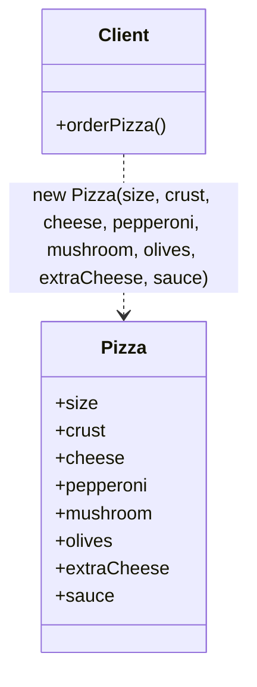
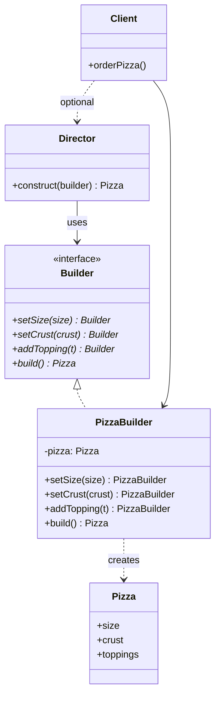

# Creational Pattern: Builder

## 1. Quick Summary
* **Intent:** Separate the **construction** of a complex object from its **representation**, so the same construction process can build different variations, step by step.
* **Core Philosophy:** Instead of one giant constructor with 10 optional params (telescoping constructor problem), build the object **incrementally** via a chain of small, readable steps, then finalize it.
* **Analogy:** Ordering a **pizza**. You don't call one function `make_pizza(size, crust, cheese, toppings, sauce, extra_cheese, ...)` with 8 positional args where you must remember the order. Instead: pick size → pick crust → add toppings → add extra cheese → done. Each step is clear, optional steps can be skipped, and order-of-calls doesn't matter for correctness.
* **Mechanism:** A separate `Builder` object exposes chained methods (`set_x()`, `add_y()`) that each return `self`, plus a `build()` method that returns the final, fully-assembled object.

---

## 2. Why Use It? (Problem vs Solution)

### Without Pattern (Telescoping Constructor)
```python
class Pizza:
    def __init__(self, size, crust="thin", cheese=True, pepperoni=False,
                 mushroom=False, olives=False, extra_cheese=False, sauce="tomato"):
        self.size = size
        self.crust = crust
        self.cheese = cheese
        self.pepperoni = pepperoni
        self.mushroom = mushroom
        self.olives = olives
        self.extra_cheese = extra_cheese
        self.sauce = sauce

# caller must remember positional order, or pass every kwarg
p = Pizza("large", "thin", True, True, False, True, False, "tomato")
```

Problems:
* **Telescoping constructor:** As optional fields grow, constructor signature becomes unreadable — hard to tell which positional arg means what.
* **Invalid intermediate states:** No way to build object gradually with validation at each step — all-or-nothing at construction time.
* **No reuse of construction logic:** If you want two similar-but-different pizzas, you duplicate almost the whole arg list.
* **Immutability vs flexibility tension:** Want object immutable once built, but also want flexible, optional, order-independent setup — plain constructor can't do both cleanly.

### With Pattern (Builder)
```python
pizza = (PizzaBuilder()
         .set_size("large")
         .set_crust("thin")
         .add_topping("pepperoni")
         .add_topping("olives")
         .set_extra_cheese()
         .build())
```
* Each step named and explicit — self-documenting, order of calls doesn't matter (except final `.build()`).
* Optional steps just get skipped — no need to pass `None`/defaults for everything you don't want.
* Builder can validate at `build()` time (e.g., "size is required") before handing back a fully valid object.

---

## 3. UML Diagrams

### Without Pattern — Telescoping Constructor

Client must supply every field, in the right order, every single time.

### With Pattern — Builder

**Key insight:** Client talks to `Builder`, calling small chained steps. `build()` returns the finished `Pizza`. Optional `Director` encodes a **fixed recipe** of builder calls (e.g., "Margherita" = specific step sequence) so client doesn't need to know the steps at all.

---

## 4. Python Implementation

### 4a. Without Pattern (Naive)
```python
class Pizza:
    def __init__(self, size, crust="thin", cheese=True, toppings=None,
                 extra_cheese=False, sauce="tomato"):
        self.size = size
        self.crust = crust
        self.cheese = cheese
        self.toppings = toppings or []
        self.extra_cheese = extra_cheese
        self.sauce = sauce

    def __repr__(self):
        return (f"Pizza(size={self.size}, crust={self.crust}, "
                f"toppings={self.toppings}, extra_cheese={self.extra_cheese})")

if __name__ == "__main__":
    # caller must remember order / pass every arg, error-prone
    p = Pizza("large", "thin", True, ["pepperoni", "olives"], True, "tomato")
```

### 4b. With Builder Pattern
```python
from __future__ import annotations

# ==========================================
# 1. PRODUCT (the complex object being built)
# ==========================================
class Pizza:
    def __init__(self) -> None:
        self.size: str | None = None
        self.crust: str = "thin"
        self.toppings: list[str] = []
        self.extra_cheese: bool = False
        self.sauce: str = "tomato"

    def __repr__(self) -> str:
        return (f"Pizza(size={self.size}, crust={self.crust}, "
                f"toppings={self.toppings}, extra_cheese={self.extra_cheese}, "
                f"sauce={self.sauce})")

# ==========================================
# 2. BUILDER
# ==========================================
class PizzaBuilder:
    def __init__(self) -> None:
        self._pizza = Pizza()

    def set_size(self, size: str) -> "PizzaBuilder":
        self._pizza.size = size
        return self                       # return self -> enables chaining

    def set_crust(self, crust: str) -> "PizzaBuilder":
        self._pizza.crust = crust
        return self

    def add_topping(self, topping: str) -> "PizzaBuilder":
        self._pizza.toppings.append(topping)
        return self

    def set_extra_cheese(self) -> "PizzaBuilder":
        self._pizza.extra_cheese = True
        return self

    def set_sauce(self, sauce: str) -> "PizzaBuilder":
        self._pizza.sauce = sauce
        return self

    def build(self) -> Pizza:
        if self._pizza.size is None:
            raise ValueError("Pizza size is required")   # validate before handing off
        return self._pizza

# ==========================================
# 3. CLIENT
# ==========================================
if __name__ == "__main__":
    pizza = (PizzaBuilder()
             .set_size("large")
             .set_crust("thin")
             .add_topping("pepperoni")
             .add_topping("olives")
             .set_extra_cheese()
             .build())

    print(pizza)
    # Pizza(size=large, crust=thin, toppings=['pepperoni', 'olives'], extra_cheese=True, sauce=tomato)
```

### 4c. Adding a Director (Fixed Recipes)
`Director` encodes **known recipes** so the client doesn't need to know which builder steps to call, or in what order:

```python
class PizzaDirector:
    @staticmethod
    def make_margherita(builder: PizzaBuilder) -> Pizza:
        return (builder.set_size("medium")
                       .set_crust("thin")
                       .add_topping("basil")
                       .set_sauce("tomato")
                       .build())

    @staticmethod
    def make_meat_lovers(builder: PizzaBuilder) -> Pizza:
        return (builder.set_size("large")
                       .set_crust("thick")
                       .add_topping("pepperoni")
                       .add_topping("sausage")
                       .add_topping("bacon")
                       .set_extra_cheese()
                       .build())

if __name__ == "__main__":
    margherita = PizzaDirector.make_margherita(PizzaBuilder())
    meat_lovers = PizzaDirector.make_meat_lovers(PizzaBuilder())
    print(margherita)
    print(meat_lovers)
```
Client now just says "give me a Margherita" — doesn't need to know the recipe steps at all. `Director` is optional; most real-world Builder usage (see §6) skips it and lets the client chain calls directly.

### 4d. Immutable Result (Common Production Variant)
Real builders often build an **immutable** final object (avoids accidental mutation after construction) — build up state in the mutable builder, then freeze it at `build()`:

```python
from dataclasses import dataclass, field

@dataclass(frozen=True)
class ImmutablePizza:
    size: str
    crust: str
    toppings: tuple[str, ...]
    extra_cheese: bool = False

class ImmutablePizzaBuilder:
    def __init__(self) -> None:
        self._size: str | None = None
        self._crust = "thin"
        self._toppings: list[str] = []
        self._extra_cheese = False

    def set_size(self, size: str) -> "ImmutablePizzaBuilder":
        self._size = size
        return self

    def add_topping(self, topping: str) -> "ImmutablePizzaBuilder":
        self._toppings.append(topping)
        return self

    def set_extra_cheese(self) -> "ImmutablePizzaBuilder":
        self._extra_cheese = True
        return self

    def build(self) -> ImmutablePizza:
        if self._size is None:
            raise ValueError("size is required")
        # freeze into an immutable object — no accidental mutation post-build
        return ImmutablePizza(
            size=self._size,
            crust=self._crust,
            toppings=tuple(self._toppings),
            extra_cheese=self._extra_cheese,
        )

if __name__ == "__main__":
    pizza = ImmutablePizzaBuilder().set_size("small").add_topping("mushroom").build()
    print(pizza)
    # pizza.size = "large"  # would raise -> frozen dataclass, immutable
```

---

## 5. Real-World Examples

| System | How Builder Is Used |
| :--- | :--- |
| **Java `StringBuilder`** | `.append()` chained calls build up a string incrementally, `.toString()` finalizes it — classic Builder shape. |
| **`urllib.request.Request` / `requests.Session`** | Build up an HTTP request piece by piece (headers, params, body) before sending. |
| **SQLAlchemy / Django ORM query builder** | `Query.filter(...).order_by(...).limit(...)` — each call returns a new/updated query object, `.all()`/`.first()` finalizes and executes. |
| **Selenium `ChromeOptions` / `webdriver.Builder`** | Chain `.add_argument()`, `.set_headless()` etc. before building the driver instance. |
| **Pydantic / Protobuf message builders** | Set fields incrementally, validate, then produce the final immutable message object. |
| **UI frameworks (Android `AlertDialog.Builder`, Flutter widget trees)** | `.setTitle().setMessage().setPositiveButton().show()` — very literal textbook Builder. |
| **Lombok `@Builder` (Java)** | Auto-generates a Builder class for a POJO so callers avoid telescoping constructors. |

---

## 6. Builder vs Other Creational Patterns

| Feature | Factory Method / Abstract Factory | Prototype | Builder |
| :--- | :--- | :--- | :--- |
| **Solves** | "Which **class/type** to instantiate" | "Copy an **existing instance** instead of building" | "**How to assemble**, step by step, a complex object" |
| **Object complexity** | Usually simple, single-step creation | Existing fully-built object | Many optional/interdependent parts, built incrementally |
| **Returns** | Immediately-usable object in one call | Clone of prototype | Object only after explicit `.build()` |
| **Typical shape** | One factory method call | `.clone()` call | Chain of setter calls + final `.build()` |

---

## 7. When to Use
1. **Object has many optional parameters** — avoids telescoping constructors / huge kwarg lists.
2. **Construction has multiple steps** that benefit from being explicit/named, possibly with validation at each step or at the end.
3. **Want same construction process to produce different representations** — e.g., `Director` building an "HTML report" vs a "PDF report" using builders with the same interface.
4. **Want the constructed object to end up immutable**, but need flexible/incremental setup before freezing it.

## 8. Pitfalls
* **Overkill for simple objects:** If object has 2–3 required fields, plain constructor/dataclass is simpler — Builder adds ceremony for no benefit.
* **Forgetting `.build()`:** Some naive builders let you use a half-configured product before calling `build()` — always finalize (and validate) explicitly at that step.
* **Builder holding mutable shared state:** If a builder instance is reused across multiple `.build()` calls without resetting, second object can leak state from the first — reset internal state after `build()`, or make builder single-use.
* **Skipping validation:** Fluent chains feel "safe" but required-field checks still need to happen (typically in `build()`) — don't assume chaining alone prevents invalid objects.

---

## 9. Interview FAQs

> [!TIP]
> **Q: What problem does Builder solve that a constructor with default args can't?**
> * Python's keyword args with defaults handle *some* of this, but Builder still wins when: construction has multiple logical **steps** (not just field assignment), steps need **validation individually**, or the same step sequence should be **reusable/named** (via a `Director`) to produce consistent variants. Builder also naturally supports building **immutable** final objects while keeping construction flexible.

> [!TIP]
> **Q: Why does each builder method `return self`?**
> * Enables **method chaining** (fluent interface) — `builder.set_x().set_y().build()` reads like a sentence and avoids `builder = builder.set_x(); builder = builder.set_y()` boilerplate.

> [!TIP]
> **Q: What's the role of the `Director`? Is it mandatory?**
> * `Director` encodes **fixed recipes** — known sequences of builder calls (e.g., "build a Margherita"). It's optional: most real-world code (StringBuilder, query builders) skips it and lets the client chain builder calls directly. Use a `Director` when you have a small set of **named, reusable** configurations you don't want re-typed everywhere.

> [!WARNING]
> **Q: Builder vs Factory — how do you tell them apart in an interview?**
> * Factory answers "**which class** to instantiate" in a single call, returning a ready object immediately. Builder answers "**how to assemble**" an object across multiple steps, returning the object only after an explicit final step (`build()`). If the object needs several optional/ordered setup steps, it's Builder; if you're just picking among a few known types to create in one shot, it's Factory.

> [!TIP]
> **Q: How do you make the built object immutable in Python?**
> * Build up state in a normal mutable builder object, then in `build()` construct and return a `frozen=True` dataclass (or `NamedTuple`) populated from the builder's internal state — see §4d. Client never touches a half-built object, and the final result can't be mutated afterward.
