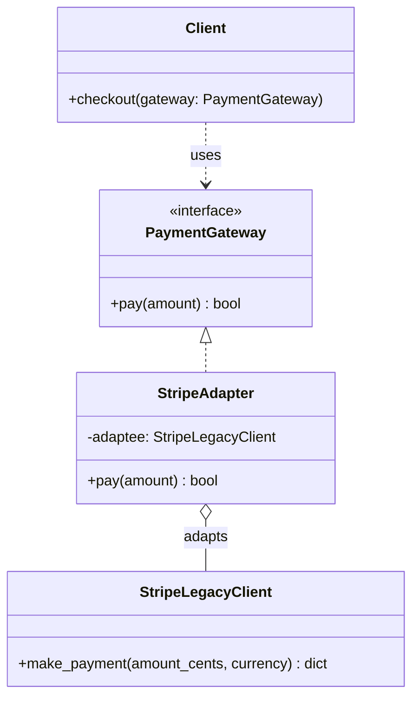

# Structural Pattern: Adapter

## 1. Quick Summary
* **Intent:** Convert the interface of a class into another interface clients expect. Lets classes with **incompatible interfaces** work together **without changing their source code**.
* **Core Philosophy:** **Translation, not transformation.** The adapter doesn't change what the underlying object does — it just translates the *interface* so the client can call it the way it expects.
* **Analogy:** A travel plug adapter. Your laptop charger has a US plug (3 flat pins), the wall socket in India is a round-pin socket. The adapter doesn't change the electricity or the charger — it just sits between them, translating the plug shape so both sides work without modification.

---

## 2. Why Use It? (The Problem vs. Solution)

### The Problem
You're building a payment service that expects every gateway to expose `pay(amount)`. Now you need to integrate a third-party gateway (`StripeLegacyClient`) — but you don't own its code, and its method is `make_payment(amount_cents, currency)`. It's a different shape entirely.

* **Can't modify the third-party class** — it's an external library/vendor SDK.
* **Client code expects one uniform interface** (`pay(amount)`) to work with any gateway interchangeably.
* **Rewriting client code per vendor** breaks Open/Closed Principle — every new vendor means touching business logic.

### The Adapter Solution
* Define the **Target interface** your client already expects (`PaymentGateway.pay(amount)`).
* Write an **Adapter class** that implements `PaymentGateway`, but internally **holds/wraps the incompatible object** (`StripeLegacyClient`) and translates calls to it.
* Client only ever talks to `PaymentGateway` — completely unaware an adapter/translation is happening underneath.

---

## 3. UML Class Diagram



**Key structural insight:** `StripeAdapter` **implements** the interface the client wants (`PaymentGateway`) while **holding a reference to** (composing) the incompatible class (`StripeLegacyClient`). Client depends only on the interface — never sees `StripeLegacyClient` directly.

---

## 4. Python Code Implementation (Object Adapter — Composition Style)

```python
from abc import ABC, abstractmethod

# ==========================================
# 1. TARGET INTERFACE (what client expects)
# ==========================================
class PaymentGateway(ABC):
    @abstractmethod
    def pay(self, amount: float) -> bool:
        pass

# ==========================================
# 2. ADAPTEE (existing incompatible class — can't modify, e.g. 3rd-party SDK)
# ==========================================
class StripeLegacyClient:
    def make_payment(self, amount_cents: int, currency: str) -> dict:
        print(f"[Stripe] Charging {amount_cents} {currency} cents")
        return {"status": "success", "amount_cents": amount_cents}

# ==========================================
# 3. ADAPTER (translates Target -> Adaptee)
# ==========================================
class StripeAdapter(PaymentGateway):
    def __init__(self, stripe_client: StripeLegacyClient) -> None:
        self._adaptee = stripe_client   # holds reference to incompatible object

    def pay(self, amount: float) -> bool:
        # translate: dollars -> cents, add currency, unwrap dict -> bool
        response = self._adaptee.make_payment(
            amount_cents=int(amount * 100),
            currency="INR",
        )
        return response["status"] == "success"

# ==========================================
# 4. CLIENT (only knows PaymentGateway, never sees StripeLegacyClient)
# ==========================================
def checkout(gateway: PaymentGateway, amount: float) -> None:
    if gateway.pay(amount):
        print(f"Payment of ₹{amount} successful")
    else:
        print("Payment failed")

# ==========================================
# 5. DEMO
# ==========================================
if __name__ == "__main__":
    stripe_client = StripeLegacyClient()
    gateway = StripeAdapter(stripe_client)
    checkout(gateway, 499.0)
    # [Stripe] Charging 49900 INR cents
    # Payment of ₹499.0 successful
```

Notice: `checkout()` never imports or knows about `StripeLegacyClient`. Add a `RazorpayAdapter` or `PaypalAdapter` tomorrow — client code doesn't change at all.

---

## 5. Object Adapter vs Class Adapter

Python only really supports **Object Adapter** (composition) since it's the idiomatic, safer approach. But interviewers (esp. Java/C++ background) may ask about **Class Adapter** (inheritance) too.

| Aspect | Object Adapter (Composition) | Class Adapter (Multiple Inheritance) |
| :--- | :--- | :--- |
| **Mechanism** | Adapter **holds a reference** to the Adaptee | Adapter **inherits from both** Target and Adaptee |
| **Flexibility** | Can adapt Adaptee **and its subclasses** at runtime (swap instances) | Bound to one specific Adaptee class, fixed at compile time |
| **Language Fit** | Works everywhere (Python, Java, C#) | Needs multiple inheritance (Python allows it, Java doesn't) |
| **Preferred?** | **Yes — favored in practice** (composition > inheritance) | Rarely used — tighter coupling, less flexible |

```python
# Class Adapter using Python multiple inheritance (just for interview awareness)
class ClassAdapterStripe(PaymentGateway, StripeLegacyClient):
    def pay(self, amount: float) -> bool:
        response = self.make_payment(int(amount * 100), "INR")
        return response["status"] == "success"
```

---

## 6. Real-World Examples

| System | How Adapter Is Used |
| :--- | :--- |
| **Python `zipfile`/`tarfile`** | Different archive libraries expose different APIs; wrapper utilities adapt them to a common file-like interface. |
| **Django REST Framework Serializers** | Adapts ORM model objects (Django `Model` instances) into a uniform dict/JSON interface for API responses. |
| **Payment/SMS/Cloud SDKs** | Wrapping Stripe/Razorpay/Twilio/AWS-S3-vs-GCS-Storage SDKs behind one internal interface (`PaymentGateway`, `SmsSender`, `ObjectStorage`) so business logic is vendor-agnostic. |
| **`collections.abc` wrappers** | Wrapping a custom data structure to expose it as a standard `Mapping`/`Sequence` so it works with code expecting built-in interfaces. |
| **Legacy system integration** | Wrapping an old SOAP/XML service behind a modern REST/JSON-style interface so new code never touches XML parsing directly. |
| **Power/plug adapters, USB-C to HDMI** | The literal real-world analogy — different physical interface, same underlying signal/purpose. |

---

## 7. Key Interview Takeaways

### Benefits
* **Reuse existing code:** Integrate legacy/3rd-party classes without modifying (or even having source access to) them.
* **Single Responsibility Principle:** Interface-translation logic lives in one place (the adapter), separate from business logic.
* **Open/Closed Principle:** Add new adapters for new vendors without touching client code.
* **Decouples client from concrete implementations:** Client only depends on the Target interface.

### Pitfalls & Disadvantages
* **Extra indirection layer:** Every call goes through translation — can add slight overhead and one more file/class to reason about.
* **Can mask design smells:** Overusing adapters everywhere might mean the codebase should have designed a common interface from the start.
* **Doesn't fix underlying incompatibility, just hides it:** If Adaptee's behavior is fundamentally different (e.g., sync vs async), the adapter can only paper over structure, not semantics.

### Adapter vs Other Patterns

| Pattern | Purpose | Key Difference from Adapter |
| :--- | :--- | :--- |
| **Decorator** | Adds *new behavior* to an object, keeps *same* interface | Adapter *changes* the interface to match what client expects; Decorator *preserves* the interface. |
| **Facade** | Provides a *simplified* interface over a *complex subsystem* (many classes) | Adapter wraps **one** incompatible interface to match another; Facade simplifies access to **many** classes/interfaces at once. |
| **Bridge** | Decouples abstraction from implementation *upfront*, both can vary independently | Adapter is applied **after the fact** to make existing incompatible code work together; Bridge is a proactive design choice from the start. |
| **Proxy** | Controls *access* to an object, same interface | Adapter changes interface; Proxy keeps interface identical, controls access/lifecycle instead. |

---

## 8. Interview FAQs

* **Q: When would you use Adapter vs just rewriting the incompatible class?**
  * *A:* Use Adapter when you **don't own or can't modify** the source (3rd-party SDK, legacy code, closed vendor library), or modifying it would break other consumers. If you own the code and no one else depends on its current shape, rewriting/refactoring directly is simpler — Adapter is a targeted fix for boundaries you don't control.

* **Q: Object Adapter or Class Adapter — which do you pick and why?**
  * *A:* Object Adapter (composition), almost always. It follows "composition over inheritance," can adapt any subclass of the Adaptee at runtime by swapping the wrapped instance, and doesn't require multiple inheritance (which many languages don't even support).

* **Q: How is Adapter different from Facade — don't both "wrap" something?**
  * *A:* Different intent and scope. Adapter wraps **one** class to translate its interface into a **different but equivalent** one the client expects — same level of functionality, different shape. Facade wraps **many** classes/subsystems to provide **one simpler** entry point — reducing complexity, not translating a mismatched interface.

* **Q: Can Adapter work two-way (bidirectional)?**
  * *A:* Yes — a **Two-Way Adapter** implements both interfaces and can be passed to code expecting either side, useful during incremental migrations where old and new interfaces must coexist temporarily.

* **Q: Does Adapter violate any SOLID principle?**
  * *A:* No — it actively supports **Open/Closed** (extend via new adapters, no modification) and **Single Responsibility** (isolates translation logic). It's one of the few patterns purely about **compatibility**, not behavior change.
