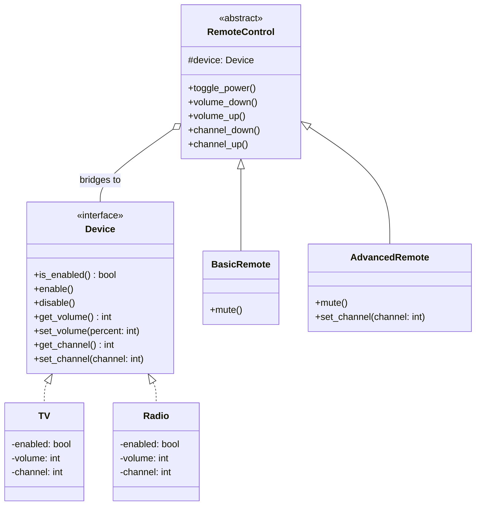

# Structural Pattern: Bridge

## 1. Quick Summary

* **Intent:** Separate an abstraction from its implementation so that both can vary independently.
* **Core philosophy:** **Composition over inheritance.** The abstraction keeps a reference to an implementation instead of inheriting from one concrete implementation.
* **Main benefit:** Add new abstractions or implementations without creating a class for every possible combination.
* **Category:** Structural design pattern.
* **Simple definition:** **Bridge is a connector between two independent class hierarchies.**

### One-line example

`RemoteControl` is an abstraction and `Device` is an implementation. A `BasicRemote` or `AdvancedRemote` can control a `TV` or a `Radio` without creating classes such as `AdvancedRadioRemote` and `BasicTVRemote`.

---

## 2. Why Do We Need the Bridge Pattern?

### The problem: two dimensions change independently

Imagine a home-entertainment application:

1. **Remote type:** Basic remote, advanced remote, voice remote.
2. **Device type:** TV, radio, projector, music player.

If we use inheritance for every combination, the number of classes grows quickly:

```text
BasicTVRemote
AdvancedTVRemote
VoiceTVRemote
BasicRadioRemote
AdvancedRadioRemote
VoiceRadioRemote
...
```

With `R` remote types and `D` device types, we may need approximately `R × D` classes.

This causes:

* **Class explosion:** Every new remote must be combined with every device.
* **Tight coupling:** A remote is tied to one concrete device.
* **Difficult maintenance:** A change in the device hierarchy affects many remote classes.
* **Poor extensibility:** Adding a new device or remote requires many new subclasses.

### The Bridge solution

Create two separate abstractions:

* **Abstraction:** The high-level concept used by the client, such as `RemoteControl`.
* **Implementation:** The lower-level capability, such as `Device`.

The abstraction stores a reference to the implementation and delegates device-specific work to it:

```text
RemoteControl ──has-a──> Device
```

Now every remote can work with every device through composition.

---

## 3. Real-Life Analogy

Think of a **universal remote control**:

* The buttons and features of the remote are one dimension.
* The actual electronic device being controlled is another dimension.
* The remote does not need to know the internal details of every TV or radio.
* It only calls common operations such as `enable()`, `disable()`, `set_volume()`, and `get_channel()`.

If a new device is introduced, we implement the device interface. If a new remote is introduced, we extend the remote abstraction. Neither side requires a class for every combination.

### Another common example

* **Shape abstraction:** `Circle`, `Square`, `Triangle`.
* **Rendering implementation:** `WindowsRenderer`, `LinuxRenderer`, `WebRenderer`.
* A shape can be rendered on any platform without creating `WindowsCircle`, `LinuxCircle`, `WebCircle`, and so on.

---

## 4. UML Class Diagram



### Roles in the pattern

| Role | Responsibility | Example |
|---|---|---|
| **Abstraction** | Defines high-level operations | `RemoteControl` |
| **Refined Abstraction** | Adds or specializes high-level behavior | `BasicRemote`, `AdvancedRemote` |
| **Implementor** | Defines low-level operations | `Device` |
| **Concrete Implementor** | Implements low-level operations | `TV`, `Radio` |
| **Bridge** | Connects the abstraction to the implementation | `RemoteControl.device` |

---

## 5. Python Code Implementation

The following example is complete and runnable:

```python
from abc import ABC, abstractmethod


# ==========================================
# 1. IMPLEMENTOR
# ==========================================
class Device(ABC):
    """Low-level operations that every controllable device supports."""

    @abstractmethod
    def is_enabled(self) -> bool:
        pass

    @abstractmethod
    def enable(self) -> None:
        pass

    @abstractmethod
    def disable(self) -> None:
        pass

    @abstractmethod
    def get_volume(self) -> int:
        pass

    @abstractmethod
    def set_volume(self, percent: int) -> None:
        pass

    @abstractmethod
    def get_channel(self) -> int:
        pass

    @abstractmethod
    def set_channel(self, channel: int) -> None:
        pass


# ==========================================
# 2. CONCRETE IMPLEMENTORS
# ==========================================
class TV(Device):
    def __init__(self) -> None:
        self._enabled = False
        self._volume = 30
        self._channel = 1

    def is_enabled(self) -> bool:
        return self._enabled

    def enable(self) -> None:
        self._enabled = True
        print("TV is ON")

    def disable(self) -> None:
        self._enabled = False
        print("TV is OFF")

    def get_volume(self) -> int:
        return self._volume

    def set_volume(self, percent: int) -> None:
        self._volume = max(0, min(100, percent))
        print(f"TV volume: {self._volume}%")

    def get_channel(self) -> int:
        return self._channel

    def set_channel(self, channel: int) -> None:
        self._channel = max(1, channel)
        print(f"TV channel: {self._channel}")


class Radio(Device):
    def __init__(self) -> None:
        self._enabled = False
        self._volume = 20
        self._channel = 101  # Radio station frequency

    def is_enabled(self) -> bool:
        return self._enabled

    def enable(self) -> None:
        self._enabled = True
        print("Radio is ON")

    def disable(self) -> None:
        self._enabled = False
        print("Radio is OFF")

    def get_volume(self) -> int:
        return self._volume

    def set_volume(self, percent: int) -> None:
        self._volume = max(0, min(100, percent))
        print(f"Radio volume: {self._volume}%")

    def get_channel(self) -> int:
        return self._channel

    def set_channel(self, channel: int) -> None:
        self._channel = max(1, channel)
        print(f"Radio station: {self._channel}")


# ==========================================
# 3. ABSTRACTION
# ==========================================
class RemoteControl(ABC):
    def __init__(self, device: Device) -> None:
        self._device = device  # This reference is the bridge.

    def toggle_power(self) -> None:
        if self._device.is_enabled():
            self._device.disable()
        else:
            self._device.enable()

    def volume_down(self) -> None:
        self._device.set_volume(self._device.get_volume() - 10)

    def volume_up(self) -> None:
        self._device.set_volume(self._device.get_volume() + 10)

    def channel_down(self) -> None:
        self._device.set_channel(self._device.get_channel() - 1)

    def channel_up(self) -> None:
        self._device.set_channel(self._device.get_channel() + 1)


# ==========================================
# 4. REFINED ABSTRACTIONS
# ==========================================
class BasicRemote(RemoteControl):
    def mute(self) -> None:
        self._device.set_volume(0)


class AdvancedRemote(RemoteControl):
    def mute(self) -> None:
        self._device.set_volume(0)

    def set_channel(self, channel: int) -> None:
        self._device.set_channel(channel)


# ==========================================
# 5. CLIENT
# ==========================================
if __name__ == "__main__":
    tv = TV()
    basic_remote = BasicRemote(tv)
    basic_remote.toggle_power()
    basic_remote.volume_up()

    radio = Radio()
    advanced_remote = AdvancedRemote(radio)
    advanced_remote.toggle_power()
    advanced_remote.set_channel(99)
    advanced_remote.mute()
```

### Expected output

```text
TV is ON
TV volume: 40%
Radio is ON
Radio station: 99
Radio volume: 0%
```

### What the code demonstrates

* `RemoteControl` does not inherit from `TV` or `Radio`.
* `RemoteControl` contains a `Device` reference, which is the bridge.
* `BasicRemote` and `AdvancedRemote` can work with both devices.
* Adding `Projector(Device)` does not require changing any remote class.
* Adding `VoiceRemote(RemoteControl)` does not require changing any device class.

---

## 6. Bridge vs. Similar Patterns

### Bridge vs. Adapter

| Bridge | Adapter |
|---|---|
| Designed up front to separate two dimensions that may vary independently | Usually introduced later to make incompatible existing interfaces work together |
| Both sides are intentionally designed around compatible abstractions | Translates one interface into another expected interface |
| Example: remote types and device types | Example: adapting a legacy payment SDK to `PaymentGateway` |

### Bridge vs. Strategy

| Bridge | Strategy |
|---|---|
| Separates two class hierarchies | Encapsulates interchangeable algorithms |
| Focuses on structural independence | Focuses on selecting behavior/algorithm |
| Example: `RemoteControl` + `Device` | Example: `Checkout` + `PaymentStrategy` |

### Bridge vs. Abstract Factory

| Bridge | Abstract Factory |
|---|---|
| Connects an abstraction to an implementation through composition | Creates families of related objects |
| Focuses on independent variation | Focuses on object creation |

---

## 7. Advantages

* **Avoids class explosion:** `R + D` main classes instead of `R × D` combinations.
* **Supports independent extension:** Add a new remote or device separately.
* **Reduces coupling:** High-level code depends on the `Device` abstraction, not concrete devices.
* **Follows Open/Closed Principle:** Existing classes generally do not need modification when adding variants.
* **Improves testability:** Pass a fake or mock `Device` into a remote.
* **Supports runtime switching:** A remote can be created with a different implementation when needed.
* **Keeps responsibilities focused:** Abstraction handles user-facing behavior; implementation handles platform/device details.

## 8. Disadvantages

* **More classes and interfaces:** The design can feel heavier than a direct implementation.
* **More indirection:** A call travels through the abstraction to the implementation.
* **Requires good boundaries:** A poorly designed implementor interface can make the bridge awkward.
* **May be overengineering:** Avoid it when there is only one stable abstraction and one stable implementation.

---

## 9. When Should You Use Bridge?

Use Bridge when:

* You can identify **two independent dimensions of change**.
* A class hierarchy is producing many combinations of subclasses.
* Platform-specific code needs to be hidden behind a stable abstraction.
* You want to switch implementations at runtime.
* You need to test high-level behavior independently from infrastructure or hardware.

Avoid Bridge when:

* There is only one implementation and no realistic variation.
* The extra abstraction does not remove meaningful complexity.
* A simple composition or direct dependency is enough.

---

## 10. Interview-Ready Explanation

### 30-second answer

> Bridge is a structural design pattern that decouples an abstraction from its implementation so both can evolve independently. The abstraction contains a reference to an implementation interface and delegates low-level work to it. For example, different remote controls can operate different devices without creating a subclass for every remote-device combination. It uses composition instead of inheritance and prevents class explosion.

### Typical interview questions

#### 1. What problem does Bridge solve?

It solves the problem of a class hierarchy having two independent variation dimensions. Without Bridge, combining every abstraction with every implementation causes a large number of subclasses.

#### 2. What is the key principle behind Bridge?

**Prefer composition over inheritance.** The abstraction has an implementation object instead of inheriting from a concrete implementation.

#### 3. What is the difference between Bridge and Adapter?

Bridge is normally planned to keep two hierarchies independent. Adapter is normally used to make an existing incompatible class match an interface expected by a client.

#### 4. Is Bridge compile-time or runtime?

The relationship is usually configured through composition, so the implementation can be selected or replaced at runtime. In Python, dependency injection makes this especially straightforward.

#### 5. How does Bridge support the Open/Closed Principle?

New abstractions and implementations can be added as new classes without changing existing remote or device classes.

#### 6. What is the biggest drawback?

It adds abstraction layers and indirection. If independent variation is not actually needed, it can make a simple design unnecessarily complex.

#### 7. Give a practical software example.

An application may have multiple report formats (`PDF`, `HTML`, `CSV`) and multiple data sources (`SQL`, `REST`, `file`). Bridge can separate report generation from data retrieval so new formats and data sources can be added independently.

---

## 11. Quick Revision Checklist

* **Category:** Structural.
* **Intent:** Decouple abstraction from implementation.
* **Relationship:** Composition (`has-a`), not inheritance (`is-a`).
* **Main actors:** Abstraction, Refined Abstraction, Implementor, Concrete Implementor.
* **Classic example:** Remote control and devices.
* **Main benefit:** Avoids `R × D` subclass combinations.
* **Remember:** Bridge is for **independent variation**; Adapter is for **interface incompatibility**.