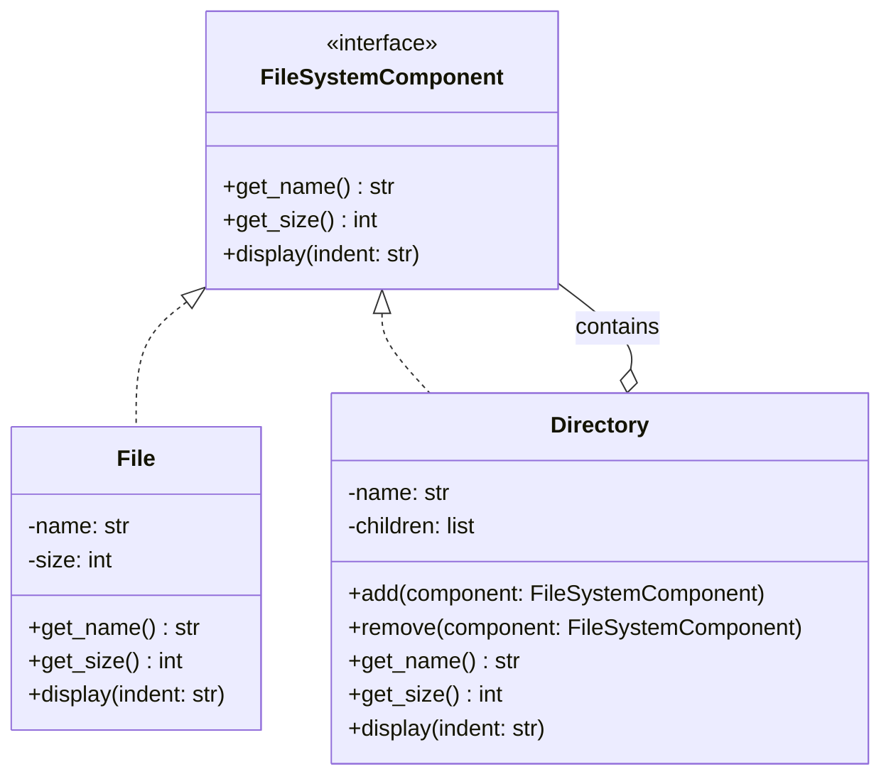

# Structural Pattern: Composite

## 1. Quick Summary

* **Intent:** Compose objects into tree structures and allow clients to treat individual objects and groups of objects uniformly.
* **Core philosophy:** **Part-whole hierarchy.** A leaf is an individual object, while a composite contains other components.
* **Main benefit:** The client can call the same operation on a single object or an entire group without checking the object's concrete type.
* **Category:** Structural design pattern.
* **Simple definition:** **Composite lets us treat one object and a collection of objects through the same interface.**

### One-line example

In a file system, a `File` is an individual item and a `Directory` contains files or other directories. Both can expose the same `show()` and `get_size()` operations.

---

## 2. Why Do We Need the Composite Pattern?

### The problem: individual objects and groups need different handling

Imagine an online shopping cart that can contain:

* Individual products
* Product bundles
* Bundles inside other bundles

Without Composite, the client may need code like this:

```python
if isinstance(item, Product):
    total += item.price
elif isinstance(item, Bundle):
    for child in item.items:
        total += child.price
```

This creates several problems:

* **Type checks spread through the application.**
* **Client code becomes coupled to concrete classes.**
* **Nested groups require recursive logic everywhere.**
* **Adding a new component type requires changing existing client code.**

### The Composite solution

Define one common `Component` interface:

* **Leaf:** Represents an individual object and performs the operation directly.
* **Composite:** Stores child components and delegates the operation to them.
* **Client:** Uses the common interface and does not need to know whether it received a leaf or a composite.

The important idea is:

```text
Component
├── Leaf
└── Composite
    ├── Leaf
    └── Composite
```

The tree can be traversed recursively because every node supports the same operation.

---

## 3. Real-Life Analogy

Think about a **company organization chart**:

* An individual employee is a leaf.
* A department is a composite containing employees and sub-departments.
* To calculate the total salary of an employee, read the employee's salary.
* To calculate the total salary of a department, add the salary of every child.
* The payroll system can call `get_salary()` on either an employee or a department.

### Other common examples

* File systems: files and directories
* GUI components: buttons, panels, and windows
* E-commerce: products and product bundles
* Menus: menu items and submenus
* Document editors: text nodes, images, and groups
* Geometry: shapes and groups of shapes

---

## 4. UML Class Diagram



### Roles in the pattern

| Role | Responsibility | Example |
|---|---|---|
| **Component** | Declares common operations for leaves and composites | `FileSystemComponent` |
| **Leaf** | Represents an individual object with no children | `File` |
| **Composite** | Contains children and implements operations recursively | `Directory` |
| **Client** | Uses the common component interface | File-system explorer |

---

## 5. Python Code Implementation

This example models a file system where both files and directories support the same operations:

```python
from abc import ABC, abstractmethod


# ==========================================
# 1. COMPONENT
# ==========================================
class FileSystemComponent(ABC):
    @abstractmethod
    def get_name(self) -> str:
        pass

    @abstractmethod
    def get_size(self) -> int:
        pass

    @abstractmethod
    def display(self, indent: str = "") -> None:
        pass


# ==========================================
# 2. LEAF
# ==========================================
class File(FileSystemComponent):
    def __init__(self, name: str, size: int) -> None:
        self._name = name
        self._size = size

    def get_name(self) -> str:
        return self._name

    def get_size(self) -> int:
        return self._size

    def display(self, indent: str = "") -> None:
        print(f"{indent}- {self._name} ({self._size} KB)")


# ==========================================
# 3. COMPOSITE
# ==========================================
class Directory(FileSystemComponent):
    def __init__(self, name: str) -> None:
        self._name = name
        self._children: list[FileSystemComponent] = []

    def add(self, component: FileSystemComponent) -> None:
        self._children.append(component)

    def remove(self, component: FileSystemComponent) -> None:
        self._children.remove(component)

    def get_name(self) -> str:
        return self._name

    def get_size(self) -> int:
        return sum(child.get_size() for child in self._children)

    def display(self, indent: str = "") -> None:
        print(f"{indent}+ {self._name}/ ({self.get_size()} KB)")
        for child in self._children:
            child.display(indent + "  ")


# ==========================================
# 4. CLIENT
# ==========================================
def print_component_details(component: FileSystemComponent) -> None:
    """Works for both File and Directory."""
    print(f"{component.get_name()} uses {component.get_size()} KB")


if __name__ == "__main__":
    readme = File("README.md", 12)
    api = File("api.py", 30)
    config = File("config.yaml", 8)
    test_api = File("test_api.py", 24)

    source = Directory("src")
    source.add(api)
    source.add(config)

    tests = Directory("tests")
    tests.add(test_api)

    project = Directory("project")
    project.add(readme)
    project.add(source)
    project.add(tests)

    # The client treats a File and the complete Directory tree uniformly.
    print_component_details(readme)
    print_component_details(project)

    print("\nProject tree:")
    project.display()
```

### Expected output

```text
README.md uses 12 KB
project uses 74 KB

Project tree:
+ project/ (74 KB)
  - README.md (12 KB)
  + src/ (38 KB)
    - api.py (30 KB)
    - config.yaml (8 KB)
  + tests/ (24 KB)
    - test_api.py (24 KB)
```

### What the code demonstrates

* `FileSystemComponent` is the common interface.
* `File` is a leaf and has no children.
* `Directory` is a composite and stores other components.
* A directory can contain files and other directories.
* `get_size()` is recursive for directories and direct for files.
* The client does not need `isinstance()` checks.

---

## 6. Component Interface Design: Safe vs. Transparent Composite

There are two common ways to design the component interface.

### Safe Composite

Only operations common to all objects are declared in `Component`.

```python
class Component(ABC):
    @abstractmethod
    def get_size(self) -> int:
        pass
```

`add()` and `remove()` exist only on `Composite`.

**Advantages:**

* Prevents invalid operations on leaves.
* Preserves type safety.
* Usually the better default design.

**Disadvantage:**

* The client may need to know that it is working with a composite when it wants to add a child.

### Transparent Composite

`add()` and `remove()` are also declared on the common component interface. A leaf may reject them or treat them as no-ops.

**Advantages:**

* The client can use every object through one interface.
* Maximum uniformity.

**Disadvantages:**

* Leaves expose operations that do not make sense for them.
* Invalid operations may fail at runtime.
* It can weaken type safety.

### Interview recommendation

Say that **Safe Composite is usually preferred** when adding children is meaningful only for composites. Transparent Composite is useful when complete uniformity is more important and the domain can handle unsupported child operations consistently.

---

## 7. Composite vs. Similar Patterns

### Composite vs. Decorator

| Composite | Decorator |
|---|---|
| Represents a tree of objects | Wraps usually one object to add behavior |
| A composite can contain many children | A decorator typically contains one wrapped component |
| Focuses on treating groups and individuals uniformly | Focuses on dynamically adding responsibilities |
| Example: directory containing files | Example: coffee wrapped with milk and sugar |

### Composite vs. Iterator

| Composite | Iterator |
|---|---|
| Defines the tree structure | Defines how to traverse a collection |
| Focuses on part-whole relationships | Focuses on access order and traversal |

### Composite vs. Chain of Responsibility

| Composite | Chain of Responsibility |
|---|---|
| One request may be sent to many children | A request usually moves through handlers until handled |
| Models a hierarchy/tree | Models a sequence or linked chain |

### Composite vs. Tree data structure

Composite is a design pattern, not merely a tree data structure. It specifically emphasizes a common interface that allows clients to treat leaves and groups uniformly.

---

## 8. Advantages

* **Uniform treatment:** The client uses one interface for individual objects and groups.
* **Natural recursive structure:** Nested groups are easy to model.
* **Less type-checking:** Business logic does not need repeated `isinstance()` checks.
* **Easy extension:** New leaf or composite types can implement the component interface.
* **Simpler client code:** Operations such as total size, price, or salary can be recursive.
* **Good fit for hierarchical domains:** It maps naturally to file systems, menus, and organization charts.

## 9. Disadvantages

* **Overly general interface:** A common interface may be difficult to design when leaves and composites have very different behavior.
* **Invalid child relationships:** Without validation, a composite might contain an inappropriate component.
* **Harder constraints:** It may be difficult to enforce rules such as “this node may contain only files.”
* **Runtime errors:** Transparent Composite can expose unsupported operations on leaves.
* **Tree traversal cost:** Recursive operations may visit every node, often taking `O(n)` time.

---

## 10. When Should You Use Composite?

Use Composite when:

* The domain naturally forms a tree or hierarchy.
* The client should treat a single object and a group in the same way.
* You frequently perform operations over an entire subtree.
* You want to remove recursive traversal and type checks from client code.
* New leaf and group types are expected over time.

Avoid Composite when:

* The relationship is flat and there is no real hierarchy.
* Leaves and groups do not share meaningful operations.
* The common interface would contain many irrelevant methods.
* Strict compile-time constraints on child types are more important than uniformity.

---

## 11. Complexity

For a tree containing `n` components:

* `add()` to a list-backed composite: usually **O(1)**.
* `remove()` from a list-backed composite: usually **O(n)**.
* `get_size()` for a complete tree: **O(n)**.
* `display()` for a complete tree: **O(n)**.
* Recursion space for a tree of height `h`: **O(h)**.

The exact complexity depends on the child collection and whether values are cached.

---

## 12. Interview-Ready Explanation

### 30-second answer

> Composite is a structural design pattern used to build tree structures. It defines a common component interface implemented by both individual objects, called leaves, and groups of objects, called composites. A composite stores child components and delegates operations recursively. This allows the client to treat a single object and a whole group uniformly. A file system is a classic example: both files and directories can expose operations such as `get_size()` and `display()`.

### Typical interview questions

#### 1. What problem does Composite solve?

It avoids separate client logic for individual objects and collections of objects. The client can call the same operation on both through a common interface.

#### 2. What are the main participants?

The participants are `Component`, `Leaf`, `Composite`, and `Client`.

#### 3. Why is Composite recursive?

A composite contains components, and those components can themselves be composites. Operations such as total size or display naturally recurse through the tree.

#### 4. What is the difference between Safe and Transparent Composite?

Safe Composite keeps child-management methods only on composites. Transparent Composite puts them on the common interface so every component appears uniform, but leaves may expose unsupported operations.

#### 5. How is Composite different from Decorator?

Composite builds a tree and usually contains multiple children. Decorator wraps one component to add behavior and usually forms a linear wrapper chain.

#### 6. What principle does Composite support?

It supports programming to an abstraction and simplifies the Open/Closed Principle: new leaf and composite types can be added without changing client traversal logic.

#### 7. What is a drawback of Composite?

The common interface may become too broad, and it can be difficult to enforce restrictions on which types a composite may contain.

#### 8. Give a practical software example.

A UI framework can treat a button as a single component and a panel as a group of components. Calling `render()` on either works uniformly, while a panel recursively renders all its children.

---

## 13. Quick Revision Checklist

* **Category:** Structural.
* **Intent:** Treat individual objects and groups uniformly.
* **Structure:** Tree or part-whole hierarchy.
* **Leaf:** Individual object with no children.
* **Composite:** Object containing child components.
* **Key technique:** Recursive delegation.
* **Classic example:** Files and directories.
* **Main benefit:** Removes repeated type checks from client code.
* **Remember:** Composite is about **tree structure and uniform treatment**; Decorator is about **adding behavior through wrappers**.