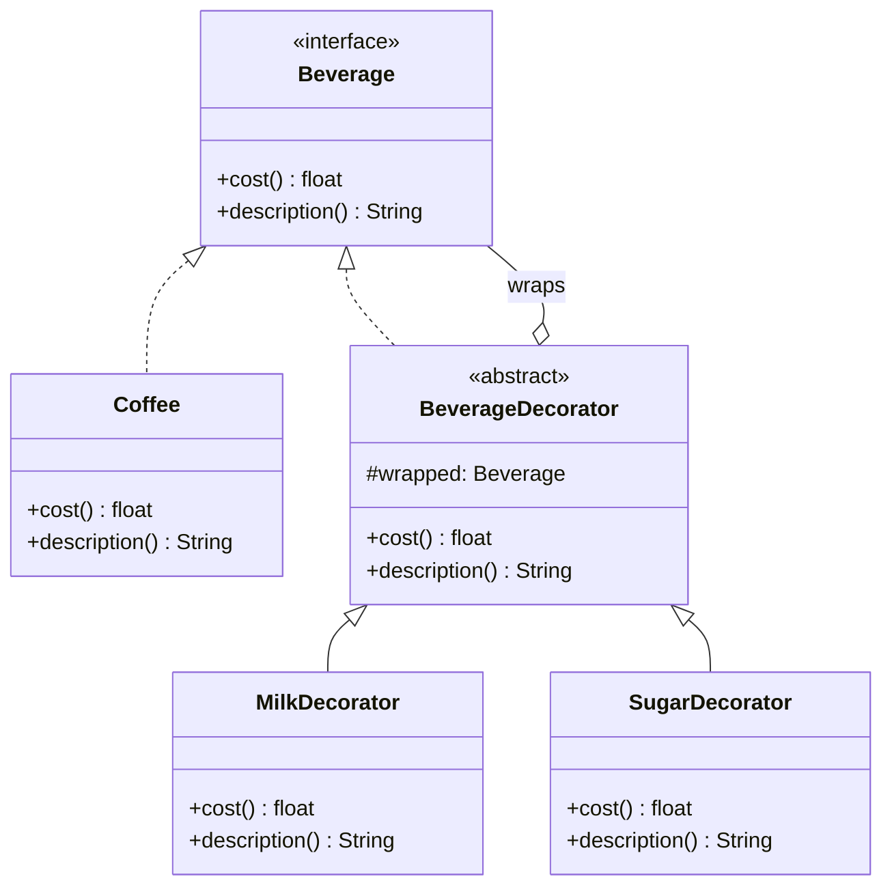
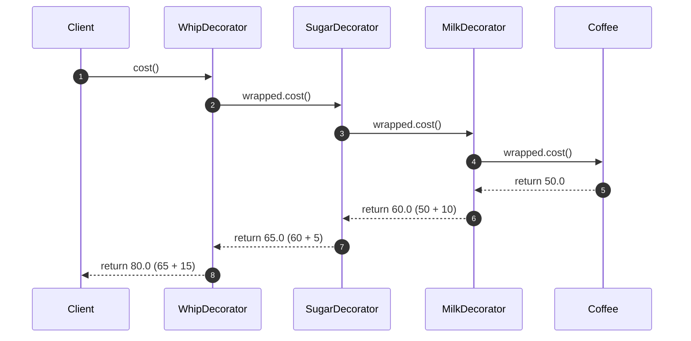

# Structural Pattern: Decorator

## 1. Quick Summary
* **Intent:** Attach new responsibilities/behavior to an object **dynamically at runtime**, without altering its class or affecting other instances of the same class.
* **Core Philosophy:** **Composition over Inheritance.** Instead of creating a rigid subclass for every combination of features, wrap the object in layers — each layer adds one behavior.
* **Analogy:** A cup of coffee. You start with plain `Coffee`. Want milk? Wrap it in `MilkDecorator`. Want sugar too? Wrap that in `SugarDecorator`. Each wrapper adds cost/description without touching the original `Coffee` class, and you can stack them in any combination.

---

## 2. Why Use It? (The Problem vs. Solution)

### Bad Design (Subclass Explosion)
Say you're building a coffee shop billing system. Coffee can optionally have Milk, Sugar, Whip. If you model every combination as a subclass:

```
Coffee, CoffeeWithMilk, CoffeeWithSugar, CoffeeWithWhip,
CoffeeWithMilkAndSugar, CoffeeWithMilkAndWhip, CoffeeWithSugarAndWhip,
CoffeeWithMilkSugarAndWhip ...
```
* **Combinatorial Explosion:** N optional features → up to 2^N subclasses.
* **Rigid at Compile Time:** Can't add/remove a feature (e.g., "extra shot") at runtime based on user choice — the combination is baked into the class.
* **Violates Open/Closed Principle:** Adding one new topping means touching/adding a pile of subclasses.

### The Decorator Solution
* Define a common `Component` interface (`Beverage`) that both the real object and its decorators implement.
* Each decorator **wraps** a `Component`, holds a reference to it, and **adds its own behavior before/after delegating** the call to the wrapped object.
* Combinations become just **nesting decorators at runtime**: `SugarDecorator(MilkDecorator(Coffee()))`.

---

## 3. UML Class Diagram



**Key structural insight:** `BeverageDecorator` **implements** the same `Beverage` interface it **wraps** (composition/aggregation arrow back to `Beverage`). This is what lets decorators be **stacked infinitely** — a decorator is itself a `Beverage`, so it can be wrapped by another decorator.

---

## 4. Python Code Implementation (Classic GoF Style)

```python
from abc import ABC, abstractmethod

# ==========================================
# 1. COMPONENT INTERFACE
# ==========================================
class Beverage(ABC):
    @abstractmethod
    def cost(self) -> float:
        pass

    @abstractmethod
    def description(self) -> str:
        pass

# ==========================================
# 2. CONCRETE COMPONENT
# ==========================================
class Coffee(Beverage):
    def cost(self) -> float:
        return 50.0

    def description(self) -> str:
        return "Coffee"

# ==========================================
# 3. BASE DECORATOR
# ==========================================
class BeverageDecorator(Beverage):
    def __init__(self, wrapped: Beverage) -> None:
        self._wrapped = wrapped   # holds reference to the object it wraps

    def cost(self) -> float:
        return self._wrapped.cost()

    def description(self) -> str:
        return self._wrapped.description()

# ==========================================
# 4. CONCRETE DECORATORS
# ==========================================
class MilkDecorator(BeverageDecorator):
    def cost(self) -> float:
        return self._wrapped.cost() + 10.0   # add behavior, then delegate

    def description(self) -> str:
        return self._wrapped.description() + " + Milk"

class SugarDecorator(BeverageDecorator):
    def cost(self) -> float:
        return self._wrapped.cost() + 5.0

    def description(self) -> str:
        return self._wrapped.description() + " + Sugar"

class WhipDecorator(BeverageDecorator):
    def cost(self) -> float:
        return self._wrapped.cost() + 15.0

    def description(self) -> str:
        return self._wrapped.description() + " + Whip"

# ==========================================
# 5. DEMO
# ==========================================
if __name__ == "__main__":
    order = Coffee()
    print(f"{order.description()} = ₹{order.cost()}")
    # Coffee = ₹50.0

    order = MilkDecorator(order)
    print(f"{order.description()} = ₹{order.cost()}")
    # Coffee + Milk = ₹60.0

    order = SugarDecorator(order)
    order = WhipDecorator(order)
    print(f"{order.description()} = ₹{order.cost()}")
    # Coffee + Milk + Sugar + Whip = ₹80.0
```

Notice: **no new subclass was ever written for a combination.** `MilkDecorator(SugarDecorator(Coffee()))` and `SugarDecorator(MilkDecorator(Coffee()))` are both valid, built at runtime from the same building blocks.

---

## 5. Sequence Diagram (Call Flow for `WhipDecorator(SugarDecorator(MilkDecorator(Coffee()))).cost()`)


* The call travels **inward** to the core object first (implicitly, via the chain of delegation), and each decorator adds its bit **on the way back out** — like peeling/wrapping an onion.

---

## 6. Python's `@decorator` Syntax vs the GoF Decorator Pattern
This is a **very common interview trap** — Python has a *language feature* also called "decorator" that is inspired by, but not identical to, the GoF pattern.

| Aspect | GoF Decorator Pattern | Python `@decorator` Syntax |
| :--- | :--- | :--- |
| **Applies to** | Objects (wraps an object instance) | Functions/classes (wraps a callable at definition time) |
| **When it wraps** | Runtime — pick and stack decorators dynamically per object | Definition time — the wrapping is fixed when the module loads |
| **Mechanism** | Composition — decorator holds a reference to the wrapped object and implements the same interface | A higher-order function that takes a function and returns a new function |
| **Goal** | Add responsibilities to *individual objects* without subclassing | Add cross-cutting behavior (logging, caching, auth) to *functions* |

Python's `@decorator` syntax is actually closer to a convenient implementation of the same *underlying idea* (wrap-and-extend) applied to functions instead of objects:

```python
import functools
import time

def timed(func):
    @functools.wraps(func)
    def wrapper(*args, **kwargs):
        start = time.perf_counter()
        result = func(*args, **kwargs)
        elapsed = time.perf_counter() - start
        print(f"{func.__name__} took {elapsed:.4f}s")
        return result
    return wrapper

@timed
def brew_coffee():
    time.sleep(0.1)
    return "Coffee ready"

brew_coffee()   # prints: brew_coffee took 0.10xxs
```
* `@timed` **wraps** `brew_coffee`, adds timing behavior **before/after** delegating the call — structurally the *same idea* as `MilkDecorator` wrapping `Coffee`, just at the function level instead of the object level.
* Multiple function decorators stack exactly like object decorators: `@timed @cached @retry def fetch(): ...` — order matters, same as `SugarDecorator(MilkDecorator(coffee))` vs `MilkDecorator(SugarDecorator(coffee))`.

---

## 7. Real-World Examples

| System | How Decorator Is Used |
| :--- | :--- |
| **Java I/O Streams** | `new BufferedReader(new InputStreamReader(new FileInputStream(file)))` — classic textbook example of layered decorators. |
| **Flask / FastAPI routes** | `@app.route("/users")` wraps a view function to add routing/request-handling behavior. |
| **Django Middleware** | Each middleware wraps the `get_response` callable, adding behavior (auth check, logging) before/after calling the next layer — literally the Decorator pattern applied to request handling. |
| **`functools.lru_cache`** | Wraps a function to add caching behavior without changing the function's own code. |
| **UI Toolkits** | Adding scrollbars/borders/shadows to a UI `Window` component by wrapping it in `ScrollableDecorator`, `BorderDecorator`, etc. |
| **Text formatting** | `BoldDecorator(ItalicDecorator(PlainText("Hello")))` → renders styled text by stacking formatting layers. |

---

## 8. Key Interview Takeaways

### Benefits
* **Open/Closed Principle:** Add new behavior (a new decorator) without modifying `Coffee` or existing decorators.
* **Single Responsibility Principle:** Each decorator handles exactly one added responsibility (just milk, just sugar).
* **Runtime Flexibility:** Combinations are chosen and composed dynamically — impossible with static inheritance.
* **Avoids Subclass Explosion:** N features need only N decorators, not 2^N subclasses.

### Pitfalls & Disadvantages
* **Many Small Objects:** Deep decorator chains create many thin wrapper objects — can hurt readability and debugging (stack traces get noisy).
* **Order Sensitivity:** Some decorator stacks are order-dependent (e.g., compress-then-encrypt vs encrypt-then-compress give different results) — easy to misuse.
* **Identity Confusion:** A decorated object is not `isinstance`-identical in behavior to the original even though it satisfies the same interface — can surprise code that does `type()` checks instead of relying on the interface.

### Decorator vs Other Patterns

| Pattern | Purpose | Key Difference from Decorator |
| :--- | :--- | :--- |
| **Proxy** | Controls *access* to an object (lazy loading, permission check, remote access) | Same structure (wraps + same interface), but intent is access control, not adding behavior. |
| **Adapter** | Makes an *incompatible* interface work with what the client expects | Changes the interface; Decorator keeps the *same* interface. |
| **Strategy** | Swaps an *entire algorithm* at runtime via composition | Strategy replaces behavior wholesale; Decorator layers/adds behavior incrementally on top of existing behavior. |
| **Inheritance** | Static, compile-time "is-a" extension | Decorator is dynamic, runtime, "has-a" composition — the actual alternative this pattern was invented to avoid. |

---

## 9. Interview FAQs

* **Q: Why not just use inheritance to add Milk/Sugar behavior?**
  * *A:* Inheritance is static — fixed at compile time, one class = one fixed combination, and leads to combinatorial subclass explosion for N optional features. Decorator lets you compose behavior dynamically at runtime, mixing and matching without new classes per combination.

* **Q: How is Decorator different from Proxy if both "wrap" an object with the same interface?**
  * *A:* It's about **intent**, not structure. Decorator's job is to **add/extend behavior** (more responsibilities). Proxy's job is to **control access** to the underlying object (e.g., lazy-init a heavy object, restrict access by permission, add caching for a remote call) — the wrapped object's core behavior isn't meant to be enriched, just gated.

* **Q: Does the order of stacking decorators matter?**
  * *A:* Yes, whenever decorators are not commutative — e.g., `EncryptDecorator(CompressDecorator(data))` behaves differently from `CompressDecorator(EncryptDecorator(data))`. Always check whether your specific decorators are order-sensitive before assuming any stacking order works.

* **Q: Is Python's `@decorator` syntax literally the GoF Decorator pattern?**
  * *A:* Not literally — GoF Decorator is an **object-composition pattern** (wrap an object, same interface, runtime composition). Python's `@decorator` is a **language feature for wrapping functions/classes at definition time** using higher-order functions. They share the *same core idea* (wrap + extend behavior before delegating), just applied at different levels (object vs function) and different times (runtime vs definition time).

* **Q: How would you implement this pattern if Python didn't require an explicit interface?**
  * *A:* Because of duck typing, you technically don't *need* the `Beverage` ABC — any object with `.cost()` and `.description()` would work. But in an interview, **always show the explicit `ABC`** to demonstrate you understand the formal Decorator structure (Component interface shared by concrete component and decorators) — that's the part that makes the pattern recognizable and enforces the contract.
