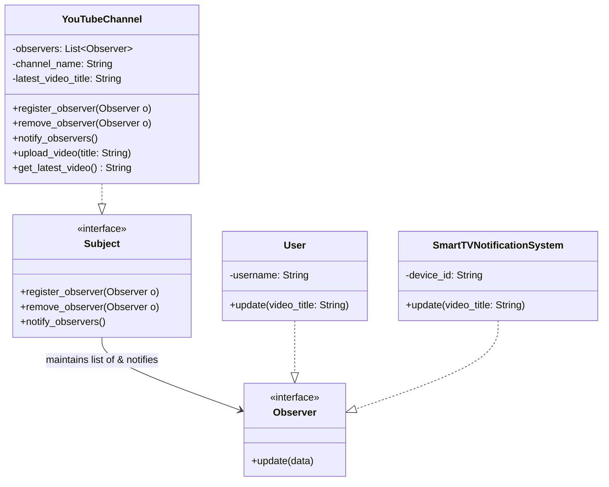
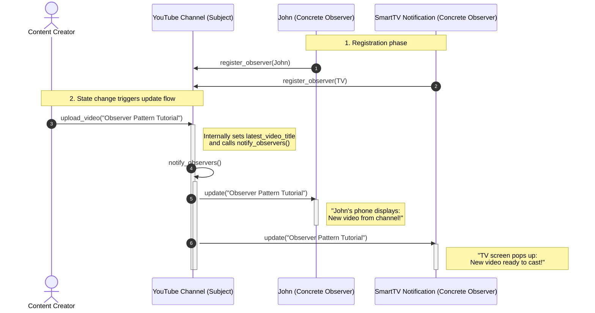

# Observer Design Pattern - Interview Revision Notes

## 1. Quick Summary
* **Intent:** Defines a one-to-many dependency between objects so that when one object changes state, all its dependents are notified and updated automatically.
* **Core Philosophy:** **Publish-Subscribe (Pub-Sub)** model at an object level. Decouples the source of the event (Subject) from the consumers of the event (Observers).
* **Analogy:** YouTube channel subscriptions. The channel (Subject) doesn't search for subscribers to show them videos. Instead, viewers subscribe, and whenever the channel uploads a video, all subscribers are notified.

---

## 2. Why Use It? (The Problem vs. Solution)

### Bad Design (Polling or Tight Coupling)
* **Approach:** Observers continuously poll/query the Subject at regular intervals to check if the state has changed.
* **Issues:**
  1. **CPU/Network Waste:** If the state changes infrequently, millions of polling requests are wasted.
  2. **High Latency:** Updates are only recognized at the next poll interval.
  3. **Tight Coupling:** If the Subject directly calls concrete observer classes, introducing a new type of observer requires modifying the Subject's code, violating the **Open/Closed Principle**.

### The Observer Solution (Event-Driven Notification)
* Define a `Subject` interface/class that maintains a list of `Observer` interface references.
* Provide methods on the Subject to `register()`, `remove()`, and `notify()` observers.
* When the Subject's state changes, it iterates over its list of registered observers and triggers their `update()` method.
* **Loose Coupling:** The Subject only knows that its observers implement the `Observer` interface. It does not care about their concrete classes or internal implementations.

---

## 3. UML Diagrams & Data Flow (YouTube Example)

### UML Class Diagram (Generic vs. YouTube)
Below is the UML structure demonstrating how the Concrete Subject (`YouTubeChannel`) and Concrete Observers (`User`, `SmartTVNotificationSystem`) relate to their respective abstractions.



### Data Flow / Sequence Diagram (How Updates Propagate)
This sequence diagram shows the step-by-step notification flow when a content creator uploads a new video:



---

## 4. Python Code Implementation

```python
from abc import ABC, abstractmethod

# ==========================================
# 1. OBSERVER INTERFACE
# ==========================================
class Observer(ABC):
    @abstractmethod
    def update(self, temperature: float, humidity: float, pressure: float) -> None:
        """Called by the Subject to notify this observer of a state change."""
        pass

# ==========================================
# 2. SUBJECT (PUBLISHER) INTERFACE
# ==========================================
class Subject(ABC):
    @abstractmethod
    def register_observer(self, observer: Observer) -> None:
        pass

    @abstractmethod
    def remove_observer(self, observer: Observer) -> None:
        pass

    @abstractmethod
    def notify_observers(self) -> None:
        pass

# ==========================================
# 3. CONCRETE SUBJECT
# ==========================================
class WeatherStation(Subject):
    def __init__(self) -> None:
        self._observers: list[Observer] = []
        self._temperature: float = 0.0
        self._humidity: float = 0.0
        self._pressure: float = 0.0

    def register_observer(self, observer: Observer) -> None:
        if observer not in self._observers:
            self._observers.append(observer)

    def remove_observer(self, observer: Observer) -> None:
        try:
            self._observers.remove(observer)
        except ValueError:
            pass

    def notify_observers(self) -> None:
        for observer in self._observers:
            # We push the data directly (Push Model)
            observer.update(self._temperature, self._humidity, self._pressure)

    def set_measurements(self, temperature: float, humidity: float, pressure: float) -> None:
        print(f"\n[WeatherStation] Measurement Update: {temperature}°C, {humidity}%, {pressure} hPa")
        self._temperature = temperature
        self._humidity = humidity
        self._pressure = pressure
        self.notify_observers()

# ==========================================
# 4. CONCRETE OBSERVERS
# ==========================================
class PhoneDisplay(Observer):
    def __init__(self, user_name: str) -> None:
        self._user_name = user_name

    def update(self, temperature: float, humidity: float, pressure: float) -> None:
        print(f"--> PhoneDisplay ({self._user_name}): Temp = {temperature}°C, Humidity = {humidity}%")

class WeatherAlertSystem(Observer):
    def update(self, temperature: float, humidity: float, pressure: float) -> None:
        if temperature > 35.0:
            print("--> WARNING [AlertSystem]: Extreme Heat Alert! Stay hydrated.")
        elif temperature < 0.0:
            print("--> WARNING [AlertSystem]: Freeze warning! Protect your plants.")
        else:
            print("--> AlertSystem: Weather is within normal parameters.")

# ==========================================
# 5. DEMO
# ==========================================
if __name__ == "__main__":
    # Initialize Subject (Publisher)
    station = WeatherStation()

    # Initialize Observers (Subscribers)
    display_john = PhoneDisplay("John")
    display_alice = PhoneDisplay("Alice")
    alert_system = WeatherAlertSystem()

    # Register Observers
    station.register_observer(display_john)
    station.register_observer(display_alice)
    station.register_observer(alert_system)

    # State update triggers automatic notification to all subscribers
    station.set_measurements(26.4, 60.0, 1012.0)

    # John unsubscribes, weather changes to extreme
    station.remove_observer(display_john)
    station.set_measurements(38.5, 45.0, 1009.0)
```

---

## 5. Key Interview Takeaways

### Benefits (SOLID Alignment)
* **Open/Closed Principle (OCP):** You can add new Observer classes (e.g., `TVDisplay`, `DatabaseLogger`) without changing the `WeatherStation` class.
* **Loose Coupling:** Subject and Observers can vary independently. They interact solely via clean abstract interfaces.
* **Broadcast Communication:** The Subject doesn't need to know the specific target or quantity of Observers; the notification is broadcast automatically to all interested parties.

### Pitfalls & Disadvantages
* **Memory Leaks (The Lapsed Listener Problem):** In languages with garbage collection, if an observer is no longer needed but fails to deregister from the Subject, the Subject retains a reference to it. This prevents the observer from being garbage-collected.
* **Performance Bottleneck / Cascade Updates:** If there are a massive number of observers, synchronous notification can block the main execution thread. If observers also update other subjects, it can cause complex cascading chains (or infinite loops).
* **Random Ordering:** Observers should never rely on the order in which they are notified.

### Push vs. Pull Model
* **Push Model (Used in Demo):** The Subject passes the detailed state data directly in the update method arguments (`update(temp, humidity, pressure)`).
  * *Pros:* Simple, direct, observers get data immediately.
  * *Cons:* Subject must know or guess what data the observers need; harder to modify the data payload interface later.
* **Pull Model:** The Subject sends a notification wrapper or just a generic notify (`update(self)` / `update()`), and the Observers query the Subject directly for the specific details they need.
  * *Pros:* More flexible; Observers fetch only what they need.
  * *Cons:* Observers must hold a reference to the Subject, increasing coupling.

### Observer Pattern vs. Publisher-Subscriber (Pub-Sub)
* Candidates often confuse these two, but they have a key architectural difference:
| Feature | Observer Pattern | Publisher-Subscriber (Pub-Sub) |
| :--- | :--- | :--- |
| **Coupling** | Loosely coupled (Subject directly knows and maintains a list of Observers in memory). | Completely decoupled (Publisher and Subscriber do not know each other; they communicate via a Broker/Event Bus). |
| **Medium** | Synchronous, direct in-memory calls. | Typically asynchronous, distributed (e.g., RabbitMQ, Kafka, Redis). |
| **Domain** | Single application / single address space. | Cross-application / distributed systems / microservices. |
