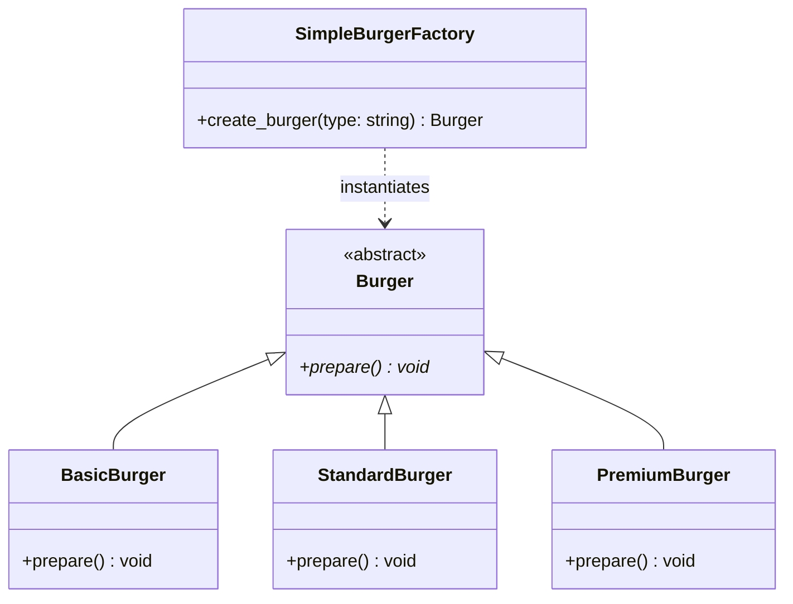
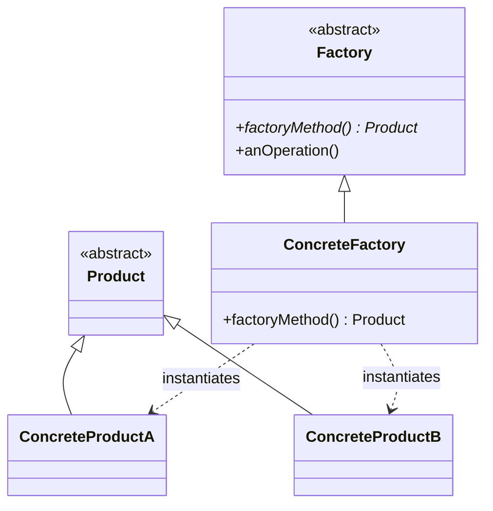
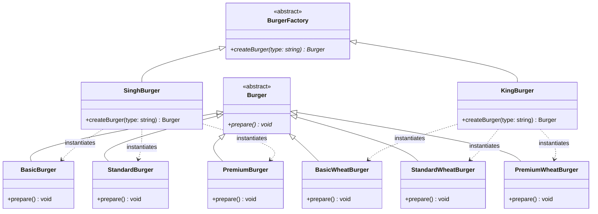
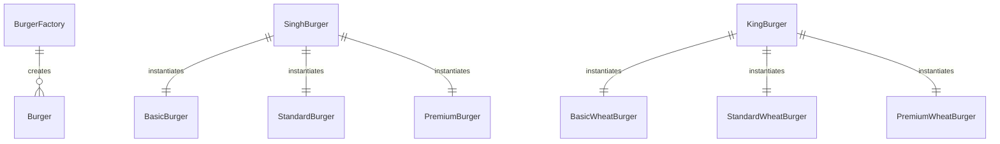
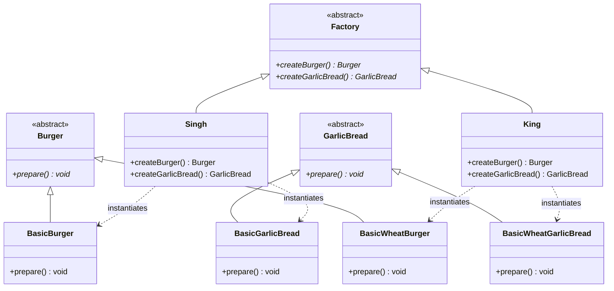
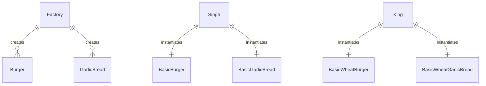

# Factory Design Pattern - Interview Revision Notes

The **Factory Design Pattern** is a **Creational Pattern** that abstracts the instantiation process of objects. It promotes loose coupling by separating the logic of object creation from the client code that uses the object.

---

## 🏗️ Core Classifications (Types) of Factory Pattern

In software design, "Factory Pattern" can refer to three distinct patterns. Interviews frequently test your ability to distinguish among them:

```mermaid
graph TD
    FactoryPattern[Factory Patterns] --> SimpleFactory[1. Simple Factory (Idiom)]
    FactoryPattern --> FactoryMethod[2. Factory Method (GoF Pattern)]
    FactoryPattern --> AbstractFactory[3. Abstract Factory (GoF Pattern)]
```

### 1. Simple Factory (Programming Idiom)
*   **Concept:** A single utility class/method that contains a central conditional statement (usually `if-else` or `switch`) to instantiate and return various concrete objects based on input parameters.
*   **Key Characteristic:** Easy to implement, but violates the **Open/Closed Principle (OCP)** because you must modify the factory class every time you introduce a new product type.

### 2. Factory Method (Gang of Four Pattern)
*   **Concept:** Defines an interface/abstract class for creating an object, but allows subclasses to alter the type of objects that will be created. It defers object instantiation to subclasses.
*   **Key Characteristic:** Follows OCP. You add new product types by creating new subclass factories instead of modifying existing code. Uses **Inheritance**.

### 3. Abstract Factory (Gang of Four Pattern)
*   **Concept:** Provides an interface for creating families of related or dependent objects (e.g., matching buns and breads) without specifying their concrete classes. It acts as a "Factory of Factories".
*   **Key Characteristic:** Solves the problem of product family dependency consistency. Uses **Composition**.

---

## ⚡ 1. Simple Factory

A single class handles the instantiation logic of products.



### 🐍 Python Implementation:
```python
from abc import ABC, abstractmethod

# Product Interface
class Burger(ABC):
    @abstractmethod
    def prepare(self) -> None:
        pass

# Concrete Products
class BasicBurger(Burger):
    def prepare(self) -> None:
        print("Preparing Basic Burger (Normal Bread)...")

class StandardBurger(Burger):
    def prepare(self) -> None:
        print("Preparing Standard Burger (Normal Bread)...")

class PremiumBurger(Burger):
    def prepare(self) -> None:
        print("Preparing Premium Burger (Normal Bread)...")

# Simple Factory Class
class SimpleBurgerFactory:
    @staticmethod
    def create_burger(burger_type: str) -> Burger:
        # Violates OCP: Adding a new burger type requires modifying this logic
        if burger_type.lower() == "basic":
            return BasicBurger()
        elif burger_type.lower() == "standard":
            return StandardBurger()
        elif burger_type.lower() == "premium":
            return PremiumBurger()
        else:
            raise ValueError(f"Unknown burger type: {burger_type}")

# Client Usage
if __name__ == "__main__":
    factory = SimpleBurgerFactory()
    burger = factory.create_burger("basic")
    burger.prepare()  # Output: Preparing Basic Burger (Normal Bread)...
```

---

## ⚡ 2. Factory Method (GoF)

Defines an interface for creating a product, but defers subclass decisions to concrete factories.

### 📊 Standard UML (Generic)


### 🍔 Burger Factory Method UML (Specific)


#### Conceptual ER-Style Relationship Diagram


### 🐍 Python Implementation:
```python
from abc import ABC, abstractmethod

# 1. Product Interface
class Burger(ABC):
    @abstractmethod
    def prepare(self) -> None:
        pass

# 2. Concrete Products (Normal Bread Family)
class BasicBurger(Burger):
    def prepare(self) -> None:
        print("Preparing Basic Burger (Normal Bread)")

class StandardBurger(Burger):
    def prepare(self) -> None:
        print("Preparing Standard Burger (Normal Bread)")

class PremiumBurger(Burger):
    def prepare(self) -> None:
        print("Preparing Premium Burger (Normal Bread)")

# Concrete Products (Wheat Bread Family)
class BasicWheatBurger(Burger):
    def prepare(self) -> None:
        print("Preparing Basic Wheat Burger")

class StandardWheatBurger(Burger):
    def prepare(self) -> None:
        print("Preparing Standard Wheat Burger")

class PremiumWheatBurger(Burger):
    def prepare(self) -> None:
        print("Preparing Premium Wheat Burger")

# 3. Creator Interface (Declares the Factory Method)
class BurgerFactory(ABC):
    @abstractmethod
    def createBurger(self, burger_type: str) -> Burger:
        """The Factory Method: Subclasses must override this"""
        pass

    def orderBurger(self, burger_type: str) -> Burger:
        # Factory method handles creation, leaving execution decoupled
        burger = self.createBurger(burger_type)
        burger.prepare()
        return burger

# 4. Concrete Creators (Override the Factory Method to defer implementation)
class SinghBurger(BurgerFactory):
    def createBurger(self, burger_type: str) -> Burger:
        if burger_type == "basic":
            return BasicBurger()
        elif burger_type == "standard":
            return StandardBurger()
        elif burger_type == "premium":
            return PremiumBurger()
        else:
            raise ValueError(f"Unknown burger type: {burger_type}")

class KingBurger(BurgerFactory):
    def createBurger(self, burger_type: str) -> Burger:
        if burger_type == "basic":
            return BasicWheatBurger()
        elif burger_type == "standard":
            return StandardWheatBurger()
        elif burger_type == "premium":
            return PremiumWheatBurger()
        else:
            raise ValueError(f"Unknown burger type: {burger_type}")

# Client Usage
if __name__ == "__main__":
    print("Ordering from Singh Burger (Normal Bread):")
    singh = SinghBurger()
    singh.orderBurger("basic")     # Output: Preparing Basic Burger (Normal Bread)
    singh.orderBurger("premium")   # Output: Preparing Premium Burger (Normal Bread)

    print("\nOrdering from King Burger (Wheat Bread):")
    king = KingBurger()
    king.orderBurger("standard")   # Output: Preparing Standard Wheat Burger
```

---

## ⚡ 3. Abstract Factory (GoF)

Provides an interface for creating families of related products (e.g., Breads/Buns & Garlic Breads) without specifying concrete classes.

### 🍔 Meal Abstract Factory UML


#### Conceptual ER-Style Relationship Diagram


### 🐍 Python Implementation:
```python
from abc import ABC, abstractmethod

# --- Abstract Products (Families) ---
class Burger(ABC):
    @abstractmethod
    def prepare(self) -> None:
        pass

class GarlicBread(ABC):
    @abstractmethod
    def prepare(self) -> None:
        pass

# --- Concrete Products for Normal Bread (Family A) ---
class BasicBurger(Burger):
    def prepare(self) -> None:
        print("Preparing Basic Burger (Normal Bread)")

class BasicGarlicBread(GarlicBread):
    def prepare(self) -> None:
        print("Preparing Basic Garlic Bread (Normal Bread)")

# --- Concrete Products for Wheat Bread (Family B) ---
class BasicWheatBurger(Burger):
    def prepare(self) -> None:
        print("Preparing Basic Wheat Burger")

class BasicWheatGarlicBread(GarlicBread):
    def prepare(self) -> None:
        print("Preparing Basic Wheat Garlic Bread")

# --- Abstract Factory Interface ---
class Factory(ABC):
    @abstractmethod
    def createBurger(self) -> Burger:
        pass

    @abstractmethod
    def createGarlicBread(self) -> GarlicBread:
        pass

# --- Concrete Factories ---
class Singh(Factory):
    # Produces Normal Bread Family products
    def createBurger(self) -> Burger:
        return BasicBurger()

    def createGarlicBread(self) -> GarlicBread:
        return BasicGarlicBread()

class King(Factory):
    # Produces Wheat Bread Family products
    def createBurger(self) -> Burger:
        return BasicWheatBurger()

    def createGarlicBread(self) -> GarlicBread:
        return BasicWheatGarlicBread()

# Client Usage
def run_bakery(factory: Factory):
    burger = factory.createBurger()
    bread = factory.createGarlicBread()
    burger.prepare()
    bread.prepare()

if __name__ == "__main__":
    print("Bakery Run: Singh (Normal Bread Products):")
    run_bakery(Singh())
    
    print("\nBakery Run: King (Wheat Bread Products):")
    run_bakery(King())
```

---

## 🆚 Quick Reference: Differences

| Feature | Simple Factory | Factory Method | Abstract Factory |
| :--- | :--- | :--- | :--- |
| **Gof Status** | ❌ Not a GoF pattern (just an idiom) |  Yes (Creational) |  Yes (Creational) |
| **Primary Mechanism** | Static/Helper helper method | Class Inheritance / Subclassing | Object Composition |
| **Return Target** | Returns one of several concrete products based on parameters. | Returns a single product using subclass overrides. | Returns a family of related products. |
| **Open/Closed Principle** | ❌ Violates. Adding new classes modifies factory method. |  Follows. Extend subclasses without modifying creator class. |  Follows. Extend new factories to handle new families. |

---

## 🎯 When to Use Factory Patterns?
1.  **Unknown/Dynamic Dependencies:** When you don't know beforehand the exact concrete classes of the objects your code needs to work with.
2.  **Encapsulation of Complexity:** When instantiation is a multi-step, complex process (e.g., loading configurations, setting default attributes).
3.  **Strict Consistency (Abstract Factory):** When you must ensure that products from the same family are used together (e.g., styling matching buttons and checkboxes).

---

## 🧠 Interview FAQs (Tips for answering)

> [!TIP]
> **Q: How does Factory Method comply with SOLID principles?**
> *   **Single Responsibility Principle (SRP):** You move the product creation code out of the business logic to a single place.
> *   **Open/Closed Principle (OCP):** You can introduce new product variations and their creators without breaking the existing client code.
> *   **Dependency Inversion Principle (DIP):** The client code relies on abstract product interfaces (`Burger`), not on concrete implementations (`BasicBurger` or `BasicWheatBurger`).

> [!WARNING]
> **Q: When should you NOT use a Factory?**
> *   **Over-engineering:** If your application is small, static, and doesn't change types, introducing Factories adds unnecessary files, boilerplate, and cognitive overhead.
