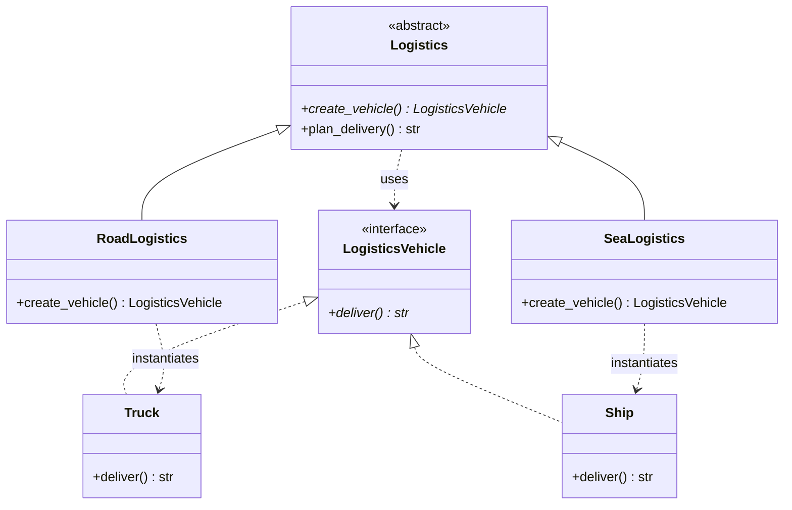
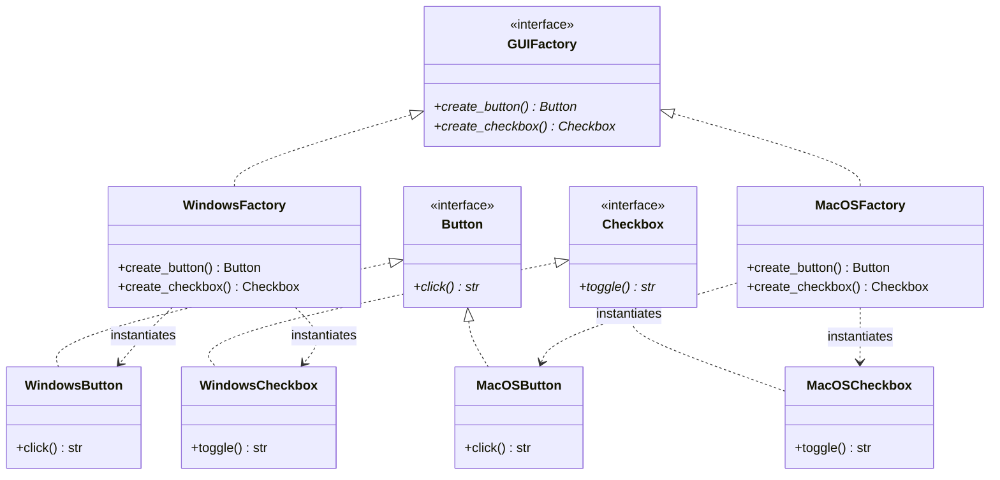

# Factory Design Pattern - Interview Revision Notes

The **Factory Design Pattern** is a **Creational Pattern** that abstracts the instantiation process of objects. It promotes loose coupling by separating the logic of object creation from the client code that uses the object.

---

## 🏗️ Core Classifications (Types) of Factory Pattern

In software design, "Factory Pattern" can refer to three distinct patterns. Interviews frequently test your ability to distinguish among them:

```mermaid
graph TD
    FactoryPattern[Factory Patterns] --> SimpleFactory[1. Simple Factory (Idiom)]
    FactoryPattern --> FactoryMethod[2. Factory Method (GoF Pattern)]
    FactoryPattern --> AbstractFactory[3. Abstract Factory (GoF Pattern)]
```

### 1. Simple Factory (Programming Idiom)
*   **Concept:** A single utility class/method that contains a central conditional statement (usually `if-else` or `switch`) to instantiate and return various concrete objects based on input parameters.
*   **Key Characteristic:** Easy to implement, but violates the **Open/Closed Principle (OCP)** because you must modify the factory class every time you introduce a new product type.

### 2. Factory Method (Gang of Four Pattern)
*   **Concept:** Defines an interface/abstract class for creating an object, but allows subclasses to alter the type of objects that will be created. It defers object instantiation to subclasses.
*   **Key Characteristic:** Follows OCP. You add new product types by creating new subclass factories instead of modifying existing code. Uses **Inheritance**.

### 3. Abstract Factory (Gang of Four Pattern)
*   **Concept:** Provides an interface for creating families of related or dependent objects (e.g., Mac Button & Mac Checkbox) without specifying their concrete classes. It acts as a "Factory of Factories".
*   **Key Characteristic:** Solves the problem of product family dependency consistency. Uses **Composition**.

---

## 🐍 Python Implementations

### ⚡ 1. Simple Factory Example

```python
from abc import ABC, abstractmethod

# Product Interface
class Notification(ABC):
    @abstractmethod
    def send(self, message: str) -> None:
        pass

# Concrete Products
class SMSNotification(Notification):
    def send(self, message: str) -> None:
        print(f"SMS: {message}")

class EmailNotification(Notification):
    def send(self, message: str) -> None:
        print(f"Email: {message}")

# Simple Factory Class
class NotificationFactory:
    @staticmethod
    def create_notification(channel: str) -> Notification:
        # Violates OCP: Adding a new channel requires modifying this logic
        if channel.lower() == "sms":
            return SMSNotification()
        elif channel.lower() == "email":
            return EmailNotification()
        else:
            raise ValueError(f"Unknown channel type: {channel}")

# Client Usage
if __name__ == "__main__":
    notifier = NotificationFactory.create_notification("sms")
    notifier.send("Hello World!")  # Output: SMS: Hello World!
```

---

### ⚡ 2. Factory Method Example (GoF)

#### UML Class Diagram


```python
from abc import ABC, abstractmethod

# 1. Product Interface
class LogisticsVehicle(ABC):
    @abstractmethod
    def deliver(self) -> str:
        pass

# 2. Concrete Products
class Truck(LogisticsVehicle):
    def deliver(self) -> str:
        return "Delivering cargo by land in box truck."

class Ship(LogisticsVehicle):
    def deliver(self) -> str:
        return "Delivering cargo by sea via container ship."

# 3. Creator Interface (Declares the Factory Method)
class Logistics(ABC):
    @abstractmethod
    def create_vehicle(self) -> LogisticsVehicle:
        """The Factory Method: Subclasses must override this"""
        pass

    def plan_delivery(self) -> str:
        # Core business logic uses the factory method to create the product
        vehicle = self.create_vehicle()
        return f"Logistics Plan: {vehicle.deliver()}"

# 4. Concrete Creators (Override the Factory Method)
class RoadLogistics(Logistics):
    def create_vehicle(self) -> LogisticsVehicle:
        return Truck()

class SeaLogistics(Logistics):
    def create_vehicle(self) -> LogisticsVehicle:
        return Ship()

# Client Usage
def client_code(logistics_service: Logistics):
    print(logistics_service.plan_delivery())

if __name__ == "__main__":
    print("Testing Road Logistics:")
    client_code(RoadLogistics())  # Output: Logistics Plan: Delivering cargo by land in box truck.

    print("\nTesting Sea Logistics:")
    client_code(SeaLogistics())   # Output: Logistics Plan: Delivering cargo by sea via container ship.
```

---

### ⚡ 3. Abstract Factory Example (GoF)

#### UML Class Diagram


```python
from abc import ABC, abstractmethod

# --- Abstract Products (Family of products) ---
class Button(ABC):
    @abstractmethod
    def click(self) -> str:
        pass

class Checkbox(ABC):
    @abstractmethod
    def toggle(self) -> str:
        pass

# --- Concrete Products for Windows ---
class WindowsButton(Button):
    def click(self) -> str:
        return "Windows Button Clicked"

class WindowsCheckbox(Checkbox):
    def toggle(self) -> str:
        return "Windows Checkbox Toggled"

# --- Concrete Products for macOS ---
class MacOSButton(Button):
    def click(self) -> str:
        return "macOS Button Clicked"

class MacOSCheckbox(Checkbox):
    def toggle(self) -> str:
        return "macOS Checkbox Toggled"

# --- Abstract Factory Interface ---
class GUIFactory(ABC):
    @abstractmethod
    def create_button(self) -> Button:
        pass

    @abstractmethod
    def create_checkbox(self) -> Checkbox:
        pass

# --- Concrete Factories ---
class WindowsFactory(GUIFactory):
    def create_button(self) -> Button:
        return WindowsButton()
    def create_checkbox(self) -> Checkbox:
        return WindowsCheckbox()

class MacOSFactory(GUIFactory):
    def create_button(self) -> Button:
        return MacOSButton()
    def create_checkbox(self) -> Checkbox:
        return MacOSCheckbox()

# Client Usage (Decoupled from OS specific widgets)
def run_ui(factory: GUIFactory):
    btn = factory.create_button()
    chk = factory.create_checkbox()
    print(btn.click())
    print(chk.toggle())

if __name__ == "__main__":
    print("Running in Windows environment:")
    run_ui(WindowsFactory())
    
    print("\nRunning in macOS environment:")
    run_ui(MacOSFactory())
```

---

## 🆚 Quick Reference: Differences

| Feature | Simple Factory | Factory Method | Abstract Factory |
| :--- | :--- | :--- | :--- |
| **Gof Status** | ❌ Not a GoF pattern (just an idiom) |  Yes (Creational) |  Yes (Creational) |
| **Primary Mechanism** | Static/Helper helper method | Class Inheritance / Subclassing | Object Composition |
| **Return Target** | Returns one of several concrete products based on parameters. | Returns a single product using subclass overrides. | Returns a family of related products. |
| **Open/Closed Principle** | ❌ Violates. Adding new classes modifies factory method. |  Follows. Extend subclasses without modifying creator class. |  Follows. Extend new factories to handle new families. |

---

## 🎯 When to Use Factory Patterns?
1.  **Unknown/Dynamic Dependencies:** When you don't know beforehand the exact concrete classes of the objects your code needs to work with.
2.  **Encapsulation of Complexity:** When instantiation is a multi-step, complex process (e.g., loading configurations, setting default attributes).
3.  **Strict Consistency (Abstract Factory):** When you must ensure that products from the same family are used together (e.g., styling matching buttons and checkboxes).

---

## 🧠 Interview FAQs (Tips for answering)

> [!TIP]
> **Q: How does Factory Method comply with SOLID principles?**
> *   **Single Responsibility Principle (SRP):** You move the product creation code out of the business logic to a single place.
> *   **Open/Closed Principle (OCP):** You can introduce new product variations and their creators without breaking the existing client code.
> *   **Dependency Inversion Principle (DIP):** The client code relies on abstract product interfaces (`LogisticsVehicle`), not on concrete implementations (`Truck` or `Ship`).

> [!WARNING]
> **Q: When should you NOT use a Factory?**
> *   **Over-engineering:** If your application is small, static, and doesn't change types, introducing Factories adds unnecessary files, boilerplate, and cognitive overhead.
