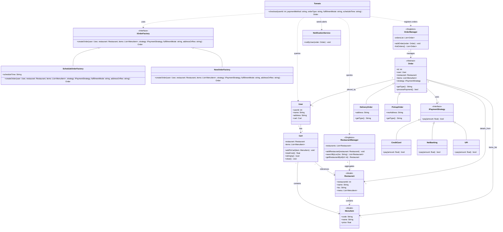
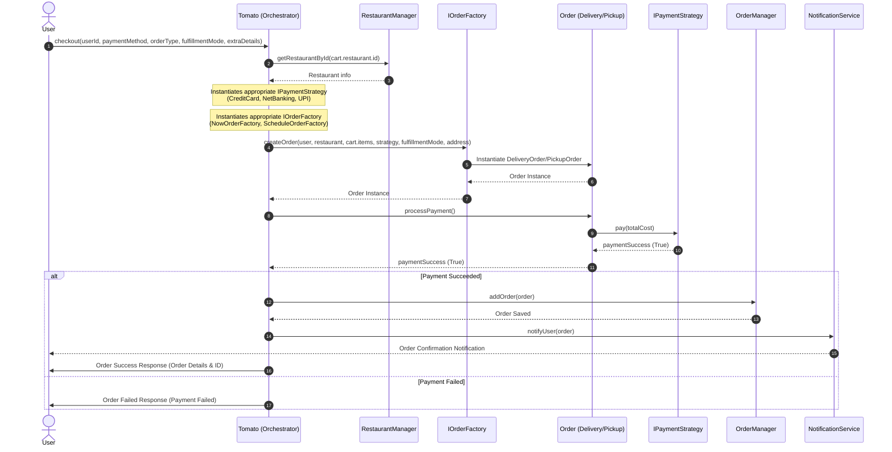

# Zomato LLD Case Study: Food Delivery System Diagrams

This document outlines the **Low-Level Design (LLD)** requirements, the **Class Diagram** (based on the system whiteboard design), and a **Sequence Diagram** showing the interaction flow during order placement.

---

## 1. System Requirements & Scope

1. **User Management**: Users have profiles with an ID, name, address, and a dynamic shopping Cart.
2. **Restaurant & Catalog Management**: Restaurants have locations and menus composed of multiple MenuItems (each with a code, name, and price).
3. **Cart Operations**: Users can add items from a single restaurant to their cart, retrieve the total cost, and check if the cart is empty.
4. **Order Factory (Factory Pattern)**: Orders can be placed either for immediate delivery (`NowOrder`) or scheduled for a later time (`ScheduleOrder`). The corresponding factories (`NowOrderFactory`, `ScheduleOrderFactory`) instantiate the appropriate objects.
5. **Order Types**: The system supports two primary fulfillment modes:
   - `DeliveryOrder`: Handled by a rider, delivered to the user's address.
   - `PickupOrder`: Prepared by the restaurant, picked up by the user directly.
6. **Payment System (Strategy Pattern)**: Customers can choose different payment methods: `CreditCard`, `NetBanking`, or `UPI`. The system invokes the chosen strategy polymorphically.
7. **Order Coordination & Management**:
   - `OrderManager` (Singleton) tracks active and past orders.
   - `RestaurantManager` (Singleton) manages restaurant registries and search queries.
   - `Tomato` (Orchestrator Class) acts as the facade/mediator that ties everything together.
8. **Notifications**: When an order is placed successfully, the `NotificationService` notifies the customer.

---

## 2. Low-Level Design Class Diagram

Below is the **Mermaid Class Diagram** representing the exact UML structure depicted on the system whiteboard design:

---

## 3. Order Flow Sequence Diagram

Here is how the orchestration class `Tomato` coordinates the order placement process among the subsystems:

