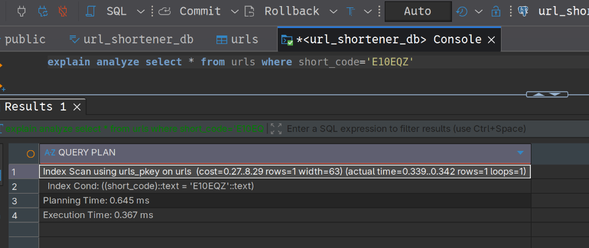

# Query Planner

Think of a Query Planner as the GPS navigation system for your database.

When you write a SQL query, you are telling the database what you want, but not how to get it. The Query Planner's job is to look at your request, analyze the "roads" (indexes) and "traffic" (data volume), and pick the most efficient path to return your data in milliseconds.

## The Life Cycle of a Query

Before your data hits the screen in DBeaver, it goes through these stages:

1. **Parser**: Checks if your SQL is grammatically correct.

2. **Rewriter**: Simplifies the query (e.g., removing unnecessary math like WHERE 1=1).

3. **Planner/Optimizer**: This is the brain. It generates multiple "Execution Plans" and calculates a Cost for each.

4. **Executor**: Runs the plan with the lowest cost and fetches the rows.

## How the Planner Decides (Scan Types)

The planner usually chooses between two main ways to find your data:

- **Sequential Scan (Full Table Scan)**: The database reads every single row in the table. This is like reading a whole book to find one word. It's fine for small tables but terrible for big ones.

- **Index Scan**: The database uses an index (like we discussed earlier) to jump straight to the data. This is much faster for large datasets.

## The "Cost" Model

The planner assigns a numeric Cost value to every plan. This isn't measured in seconds, but in "units of effort" (mostly CPU and Disk I/O).

- **Sequential Scan Cost**: High if the table is large.

- **Index Scan Cost**: Low if you are looking for a specific ID, but can be high if you are fetching 90% of the table (sometimes it's faster to just scan the whole thing than to jump back and forth using an index).

## How to see the Plan (The EXPLAIN Command)

As a developer, you can see what the "GPS" is thinking by putting EXPLAIN or EXPLAIN ANALYZE before your query.

In DBeaver, try this:

```SQL
EXPLAIN ANALYZE SELECT * FROM URLS WHERE short_code = 'E10E0Z';
```

What to look for in the output:



- **Seq Scan**: ⚠️ Warning! Your query is not using an index. It will get slower as your GitCash user base grows.

- **Index Scan**: ✅ Success! Your index is working.

- **Actual time**: Tells you exactly how long each step took in milliseconds.

## Why the Planner gets "Stupid" (Stale Statistics)

The planner makes decisions based on Statistics (e.g., "I think this table has about 10,000 rows").

If you suddenly delete 9,000 rows, the planner might still think the table is huge and choose a slow path. In PostgreSQL, we fix this by running:

```SQL
ANALYZE urls;
```

This updates the database's internal "map" so the GPS knows where the new shortcuts are.
