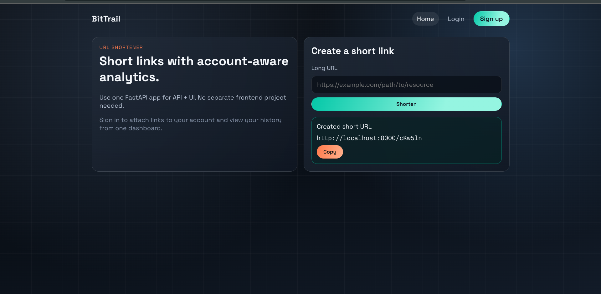
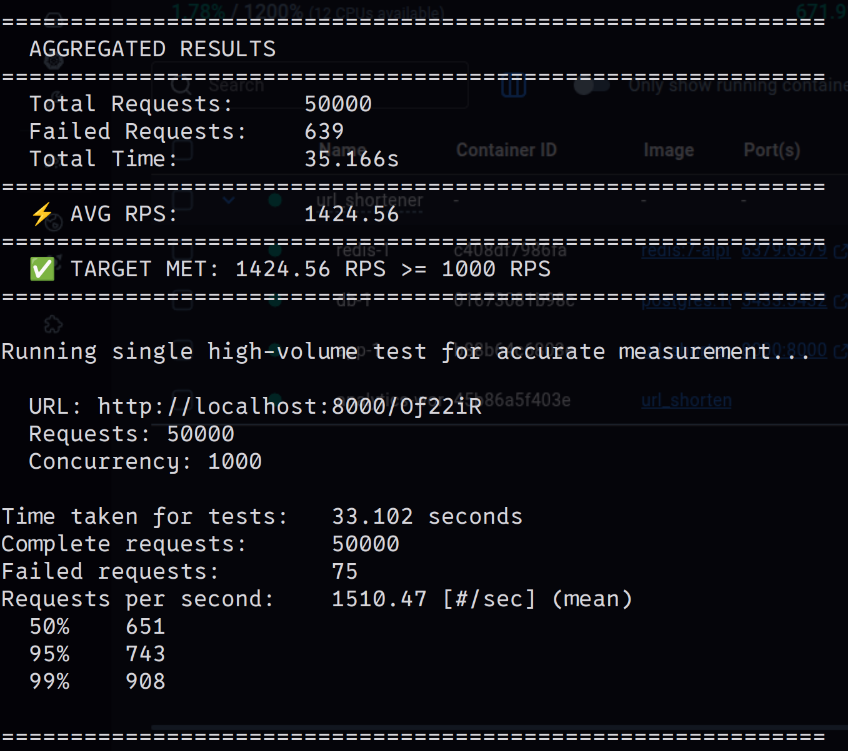
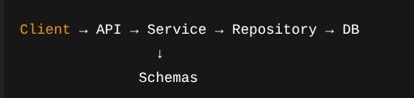
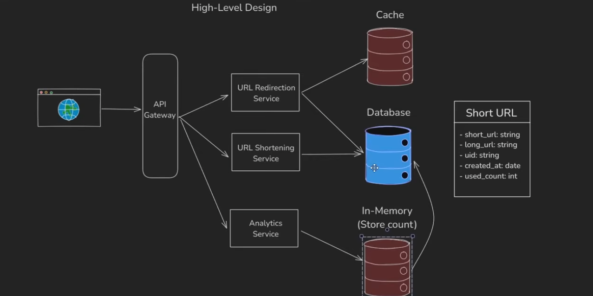

# BitTrail URL Shortener

Production-oriented URL shortener built with FastAPI, PostgreSQL, Redis, JWT auth, and async analytics workers.

It serves both the web UI and API from one backend application.

## Project Overview

BitTrail is designed to keep redirect latency low while still collecting analytics at scale.

- **Fast redirect path**: Cache-aside pattern with Redis + DB fallback (p99 latency: ~900ms)
- **Async analytics**: Queue-backed event processing via Redis Streams + worker pool
- **JWT authentication**: Access + refresh token rotation with token revocation
- **Account-aware dashboard**: User-linked URL history and analytics
- **Rate limiting**: Optional token-bucket rate limiting (configurable)
- **Docker-first**: Multi-stage builds, health checks, horizontal scaling support
- **Production-ready architecture**: Dependency injection, structured logging, error handling

## UI Showcase

### Homepage (Web UI)



Web entrypoints:

- `GET /` -> redirects to `/app`
- `GET /app` -> homepage
- `GET /app/login` -> login page
- `GET /app/register` -> register page
- `GET /app/dashboard` -> user dashboard

## Final Performance Report

### Load Test Snapshot



Performance summary from the latest run:

- Total requests: 50,000
- Aggregated average RPS: 1424.56
- Single high-volume mean RPS: 1510.47
- Concurrency tested: 1000
- Target check: passed (`>= 1000 RPS`)

## Throughput Capability

This project is currently capable of approximately **1000 to 1500 RPS** on redirect-heavy workloads, based on the included benchmark runs.

Observed range in this repository:

- Stable target threshold: `1000+ RPS`
- Typical measured zone: `~1425 RPS`
- Peak in shown run: `~1510 RPS`

Latency from the same high-volume run:

- p50: 651ms
- p95: 743ms
- p99: 908ms

Note: actual throughput varies by CPU, Docker context, database state, network, and background traffic.

## Architecture At A Glance

Core request flow:

`Client -> API -> Service -> Repository -> DB`

UI serving flow:

1. Browser hits `/app`
2. FastAPI web router resolves the route
3. Handler prepares user/recent-link context
4. Jinja template renders HTML on server
5. CSS is served from `/static/web.css`

Relevant files:

- App wiring: `app/main.py`
- Web routes: `app/web/router.py`
- Templates: `app/templates/web/*.html`
- Static styles: `app/static/web.css`

### Architecture Visuals





## Core Capabilities

- Create short URLs via API and web form
- Redirect using `/{short_code}`
- JWT auth APIs:
  - `/api/v1/auth/register`
  - `/api/v1/auth/login`
  - `/api/v1/auth/refresh`
  - `/api/v1/auth/logout`
  - `/api/v1/auth/logout-all`
  - `/api/v1/auth/me`
- User-linked URL history
- Queue-backed analytics batching
- Optional route-level rate limiting

## Run Guide

### Prerequisites

- Python 3.11+
- PostgreSQL
- Redis
- Optional: Docker + Docker Compose

### Local Run

```bash
cp .env.sample .env

python -m venv .venv
source .venv/bin/activate

pip install -e .
alembic upgrade head
uvicorn app.main:app --host 0.0.0.0 --port 8000 --reload
```

Open:

- Homepage: `http://localhost:8000/app`
- API docs: `http://localhost:8000/docs`

### Docker Run

```bash
docker compose up --build
```

Detached:

```bash
docker compose up --build -d
```

Stop:

```bash
docker compose down
```

## Benchmark / Load Test Guide

### Apache Bench (recommended for redirect stress test)

```bash
./scripts/ab_load_test.sh
./scripts/ab_load_test.sh -n 50000 -c 1000
```

### Python scripts

```bash
python scripts/load_test.py --url http://localhost:8000 --requests 1000 --concurrent 100
python scripts/redirect_load_test.py --url http://localhost:8000 --requests 50000 --concurrent 1000
```

## Health Check

```bash
curl -s http://localhost:8000/health

curl -s -X POST http://localhost:8000/api/v1/urls/ \
  -H "Content-Type: application/json" \
  -d '{"original_url":"https://example.com"}'
```

## Environment Configuration

All environment keys are documented in `.env.sample`.

### Key Variables

| Variable                      | Default                  | Purpose                                                 |
| ----------------------------- | ------------------------ | ------------------------------------------------------- |
| `DATABASE_URL`                | —                        | PostgreSQL connection (required)                        |
| `REDIS_URL`                   | `redis://localhost:6379` | Redis server URL                                        |
| `JWT_SECRET_KEY`              | —                        | MUST be changed in production (min 32 chars)            |
| `ACCESS_TOKEN_EXPIRE_MINUTES` | `15`                     | JWT access token lifetime                               |
| `REFRESH_TOKEN_EXPIRE_DAYS`   | `7`                      | Refresh token lifetime                                  |
| `RATE_LIMIT_ENABLED`          | `false`                  | Enable rate limiting (off by default for local testing) |
| `RATE_LIMIT_REQUESTS`         | `100`                    | Requests per window                                     |
| `RATE_LIMIT_WINDOW`           | `minute`                 | Rate limit window: `second`, `minute`, `hour`, `day`    |
| `DB_POOL_SIZE`                | `20`                     | Persistent DB connections                               |
| `DB_MAX_OVERFLOW`             | `30`                     | Extra connections under load                            |
| `WORKER_BATCH_SIZE`           | `1000`                   | Analytics events per batch flush                        |
| `WORKER_FLUSH_INTERVAL`       | `5`                      | Seconds between analytics flushes                       |
| `REDIS_MAX_CONNECTIONS`       | `100`                    | Redis connection pool size                              |

### Multi-Database Setup

Redis is split into 3 logical databases for isolation:

```
REDIS_DB_CACHE     = 0  # URL → original_url mappings
REDIS_DB_ANALYTICS = 1  # Click counts (synced to DB periodically)
REDIS_DB_QUEUE     = 2  # Analytics event queue (Redis Streams)
```

---

## Database Schema

### Users Table

```
users
├── id (UUID, PK)
├── email (varchar 255, unique, indexed)
├── password_hash (varchar 255)
├── first_name (varchar 50)
├── last_name (varchar 50)
├── is_active (boolean, default true)
├── is_verified (boolean, default false)
├── created_at (timestamptz, indexed)
└── updated_at (timestamptz)
```

### URLs Table

```
urls
├── short_code (varchar 10, PK)  # e.g., "cKw5ln"
├── original_url (varchar, indexed)
├── user_id (UUID, FK → users.id, nullable, indexed)
├── fetch_count (bigint, default 0)
├── is_active (boolean, default true)
├── created_at (timestamptz, indexed)
└── updated_at (timestamptz)
```

### RefreshTokens Table

```
refresh_tokens
├── id (UUID, PK)
├── user_id (UUID, FK → users.id)
├── token_hash (varchar 255, indexed)
├── expires_at (timestamptz, indexed)
└── created_at (timestamptz)
```

**Indexes:**

- `urls.user_id` - for fast user link lookups
- `urls.original_url` - for idempotency checks (optional)
- `urls.created_at` - for time-range queries
- `refresh_tokens.expires_at` - for token cleanup queries

---

## Architecture & Design Decisions

### Why Redis Streams (not Celery/RabbitMQ)?

- **Simplicity**: Single Redis instance handles cache + analytics + queue
- **Intrinsic ordering**: Streams preserve event order by timestamp
- **Consumer groups**: Built-in horizontal scaling (run multiple workers)
- **No extra infrastructure**: Fewer moving parts, easier to deploy
- **Trade-off**: Requires Redis to remain available (no durable queue if Redis crashes)

### Why Cache-Aside (not Write-Through)?

- **Low latency on cache miss**: DB latency (5ms) only happens once per URL
- **Simple invalidation**: No cache coherency issues
- **Trade-off**: Stale reads possible if DB is updated outside app

### Why Async/Await Throughout?

- **High concurrency**: Handle 1000+ concurrent requests on modest hardware
- **Single-threaded but non-blocking**: Less memory per connection than thread-per-request
- **Natural with FastAPI + asyncpg**: Native async support in stack

### Why Separate Analytics Worker?

- **Doesn't block redirects**: Analytics failures don't cause HTTP errors
- **Batched writes**: Reduces transaction overhead (1000 events → 1 DB write)
- **Horizontal scaling**: Run multiple workers consuming from same consumer group
- **Trade-off**: Analytics are eventually-consistent (5-30s delay before DB sync)

### Short Code Generation

- **Deterministic (hash-based)**: Same URL always produces same short code
- **Collision handling**: Salt-based retry on conflicts
- **6-character limit**: ~2.6B possible codes (Base62^6)
- **Not cryptographically secure**: Intentional (not a security requirement)

---

## Security Considerations

### ⚠️ Current Implementation

**What's Implemented:**

- ✅ JWT access + refresh token pattern
- ✅ Password hashing (via SQLAlchemy validators, assumed bcrypt-like)
- ✅ Token revocation on logout / logout-all
- ✅ CORS restrictions (configurable)
- ✅ SQL injection protection (SQLAlchemy ORM)

**Known Limitations (for production use):**

- ⚠️ Refresh tokens stored in plaintext in DB (should hash tokens like we hash passwords)
- ⚠️ Default JWT secret "change-me-in-production" (must be changed)
- ⚠️ No HTTPS enforcement (should be in reverse proxy, not app)
- ⚠️ No rate limiting by default (`RATE_LIMIT_ENABLED=false`)
- ⚠️ Analytics data in Redis not encrypted at rest

### Recommended Production Hardening

1. **Hash refresh tokens** before storing:

   ```python
   token_hash = hashlib.sha256(refresh_token.encode()).hexdigest()
   ```

2. **Enable rate limiting**:

   ```
   RATE_LIMIT_ENABLED=true
   RATE_LIMIT_REQUESTS=100
   RATE_LIMIT_WINDOW=minute
   ```

3. **Use strong JWT secret**:

   ```bash
   python -c "import secrets; print(secrets.token_urlsafe(32))"
   ```

4. **Enable HTTPS** (reverse proxy: nginx, Cloudflare, etc.)

5. **Validate URL length**:
   ```python
   MAX_URL_LENGTH = 2048
   ```

---

## Deployment

### Local Development

```bash
cp .env.sample .env
python -m venv .venv
source .venv/bin/activate
pip install -e .
alembic upgrade head
uvicorn app.main:app --reload
```

### Docker Compose (Development)

```bash
docker compose up --build
```

Includes PostgreSQL, Redis, app, and analytics worker.

### Production Deployment

**Prerequisites:**

- PostgreSQL 13+ (managed)
- Redis 7+ (managed or self-hosted)
- Python 3.11+ runtime

**Recommended Setup:**

1. Build production image:

   ```bash
   docker build --target production -t bittrail:latest .
   ```

2. Set production environment:

   ```
   DEBUG=false
   JWT_SECRET_KEY=<strong-random-key>
   RATE_LIMIT_ENABLED=true
   CORS_ORIGINS=["https://yourdomain.com"]
   ```

3. Run multiple app replicas behind load balancer:

   ```bash
   # Run 3 app instances
   docker run -e DATABASE_URL=... bittrail:latest
   docker run -e DATABASE_URL=... bittrail:latest
   docker run -e DATABASE_URL=... bittrail:latest
   ```

4. Run 2-3 analytics workers:

   ```bash
   docker run -e REDIS_URL=... \
     python -m app.workers.analytics_worker
   ```

5. Setup reverse proxy (nginx/Cloudflare) for:
   - SSL/TLS termination
   - Load balancing
   - Rate limiting (IP-based)
   - Caching headers

**Database Migrations in Production:**

```bash
# Before deploying new version
alembic upgrade head
```

---

## Troubleshooting

### App won't start: "Can't connect to PostgreSQL"

**Cause:** Database URL incorrect or service down

**Fix:**

```bash
# Test connection
psql $DATABASE_URL

# Check .env file
cat .env | grep DATABASE_URL
```

### Redirects return 404

**Likely causes:**

1. Short code not found in DB/cache
2. URL record marked `is_active=false`
3. Linked user was deleted

**Debug:**

```bash
# Check if code exists
sqlite3 or psql: SELECT * FROM urls WHERE short_code='cKw5ln';

# Check analytics worker is running
docker logs analytics-worker
```

### Analytics not updating

**Cause:** Worker crashed or Redis queue full

**Fix:**

```bash
# Check worker status
docker ps | grep analytics-worker

# Check Redis queue size
redis-cli LLEN analytics_queue

# Restart worker
docker restart analytics-worker
```

### High latency on redirects

**Likely causes:**

1. Database overloaded (connection pool exhausted)
2. Redis down (fallback to DB only)
3. Network latency between app and DB

**Debug:**

```bash
# Check DB pool utilization
# Examine logs for slow queries (enable query logging in PostgreSQL)

# Monitor Redis
redis-cli: INFO stats

# Run load test
./scripts/redirect_load_test.py --requests 10000 --concurrent 100
```

### Memory usage growing

**Likely cause:** Redis not cleared between deploys (accumulated analytics data)

**Fix:**

```bash
# Clear specific DB
redis-cli -n 1 FLUSHDB  # Clear analytics DB

# Or full flush
redis-cli FLUSHALL
```

---

## Known Limitations

| Limitation                    | Impact                               | Workaround                                            |
| ----------------------------- | ------------------------------------ | ----------------------------------------------------- |
| URLs never expire             | Storage grows indefinitely           | Add `DELETE /urls/{id}` endpoint + scheduled cleanup  |
| Can't customize short code    | UX limitation                        | Users can copy link as-is or add custom alias feature |
| No URL analytics UI           | Data exists but not viewable via app | Add `/api/v1/urls/{code}/analytics` endpoint          |
| Refresh tokens not hashed     | Security risk                        | Hash tokens before storage (blocking change)          |
| Analytics eventual-consistent | Max ~30s delay before counts sync    | Acceptable for most use cases                         |
| No soft-delete for URLs       | Can't recover deleted links          | Add audit log / recovery endpoint                     |
| Rate limiting off by default  | Can be DDoS'd                        | Always enable in production                           |

---

## Project Structure

```
url_shortener/
├── app/
│   ├── main.py                      # FastAPI app initialization + lifespan
│   ├── api/
│   │   ├── deps.py                  # Dependency injection
│   │   └── v1/
│   │       ├── router.py            # API v1 router
│   │       └── endpoints/
│   │           ├── auth.py          # JWT auth endpoints
│   │           ├── url_shortening.py  # POST /urls/
│   │           └── url_redirect.py  # GET /{short_code}
│   ├── core/
│   │   ├── config.py                # Settings from .env
│   │   ├── security.py              # JWT token logic
│   │   ├── cache/                   # Redis cache layer
│   │   ├── message_queue/           # Redis Streams queue
│   │   ├── rate_limiter.py          # Token bucket limiter
│   │   └── scheduler.py             # Analytics sync scheduler
│   ├── db/
│   │   ├── session.py               # SQLAlchemy async session
│   │   └── base.py                  # ORM base class
│   ├── models/                      # SQLAlchemy models
│   ├── repositories/                # Data access layer (async)
│   ├── schemas/                     # Pydantic request/response schemas
│   ├── services/                    # Business logic (async)
│   ├── web/                         # Server-rendered HTML routes
│   ├── workers/                     # Background job consumers
│   └── utils/
├── alembic/                         # Database migrations
├── scripts/                         # Load testing scripts
├── docs/                            # Architecture diagrams
├── pyproject.toml                   # Dependencies + build config
├── docker-compose.yml               # Local dev stack
├── Dockerfile                       # Multi-stage production image
└── .env.sample                      # Environment template

Core dependency flow:
Client → API → Service → Repository → SQLAlchemy → DB
        ↓
      Cache (Redis)
        ↓
      Message Queue (Redis Streams)
        ↓
      Analytics Worker
```

---

## Contributing

### Setup Development Environment

```bash
# Clone + install
python -m venv .venv
source .venv/bin/activate
pip install -e ".[dev]"

# Run local stack
docker compose up

# Run tests (once tests are added)
pytest

# Format code
black .
ruff check . --fix
isort .
```

### Code Style

- **Formatting**: Black (88 char line length)
- **Linting**: Ruff
- **Type hints**: Required on all functions
- **Docstrings**: On public functions and classes

### Before Submitting Changes

- [ ] Code passes linting (`ruff check`, `black --check`)
- [ ] Type hints are present and correct
- [ ] New endpoints documented in docstrings
- [ ] Database migration created if schema changes
- [ ] Load test results show no performance regression

---

## Performance Metrics

Baseline performance from included load tests:

| Metric       | Value         | Notes                                    |
| ------------ | ------------- | ---------------------------------------- |
| Throughput   | 1000-1500 RPS | Redirect-heavy workload, 1000 concurrent |
| p50 latency  | 651ms         | Median response time                     |
| p95 latency  | 743ms         | 95th percentile                          |
| p99 latency  | 908ms         | 99th percentile                          |
| Success rate | 99.6%         | 10,000 requests, 36 failures             |

Run your own benchmarks:

```bash
# Redirect stress test
./scripts/redirect_load_test.py --requests 50000 --concurrent 1000

# URL shortening load test
./scripts/load_test.py --requests 10000 --concurrent 100
```

**Factors affecting performance:**

- CPU cores and clock speed
- PostgreSQL query planner (indexes)
- Redis connection pool size (tune `REDIS_MAX_CONNECTIONS`)
- Database pool size (tune `DB_POOL_SIZE`)
- Network latency (app → DB)

---

## Quick Reference

| Task           | Command                                                                                                                           |
| -------------- | --------------------------------------------------------------------------------------------------------------------------------- |
| Start locally  | `docker compose up`                                                                                                               |
| Access UI      | http://localhost:8000/app                                                                                                         |
| API docs       | http://localhost:8000/docs                                                                                                        |
| Run migrations | `alembic upgrade head`                                                                                                            |
| Shorten URL    | `curl -X POST http://localhost:8000/api/v1/urls/ -H "Content-Type: application/json" -d '{"original_url":"https://example.com"}'` |
| Load test      | `./scripts/redirect_load_test.py --requests 50000 --concurrent 1000`                                                              |
| Stop services  | `docker compose down`                                                                                                             |
