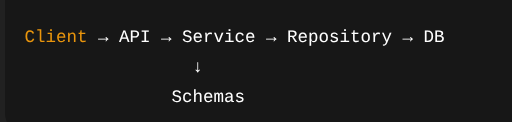

# Folder structure of the project

## Layered Architecture



Each layer has one responsibility → clean, scalable, testable.

## Folder Architecture

```bash
url_shortener/
│
├── app/
│   ├── main.py
│   │
│   ├── core/              # App config & settings
│   │   ├── config.py
│   │   └── security.py
│   │
│   ├── api/               # Route layer
│   │   ├── deps.py
│   │   └── v1/
│   │       ├── router.py
│   │       └── endpoints/
│   │           └── url.py
│   │
│   ├── models/            # SQLAlchemy models
│   │   └── url.py
│   │
│   ├── schemas/           # Pydantic schemas
│   │   └── url.py
│   │
│   ├── services/          # Business logic
│   │   └── url_service.py
│   │
│   ├── repositories/      # DB queries
│   │   └── url_repo.py
│   │
│   ├── db/
│   │   ├── base.py
│   │   └── session.py
│   │
│   └── utils/
│       └── shortener.py
│
├── alembic/
├── tests/
├── .env
└── pyproject.toml / requirements.txt

```
